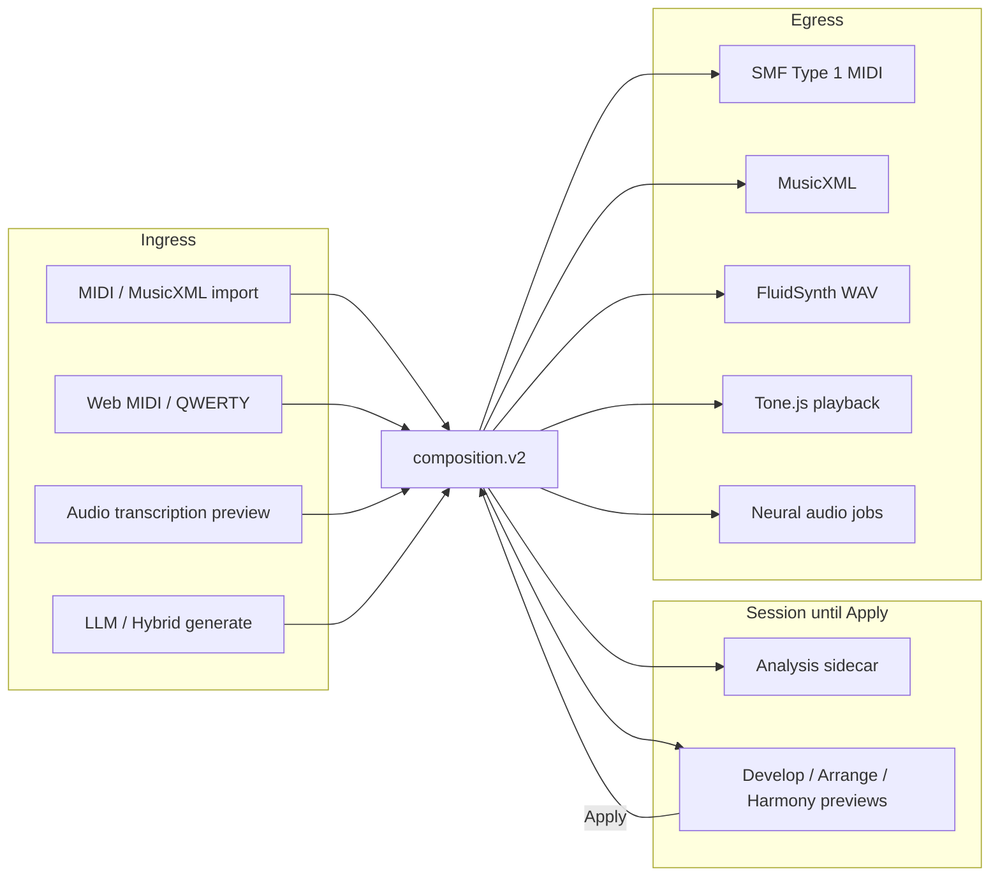
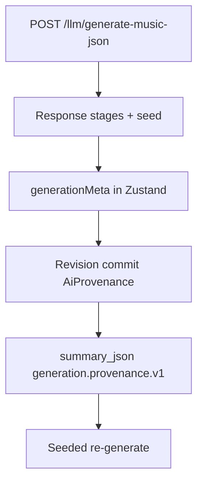
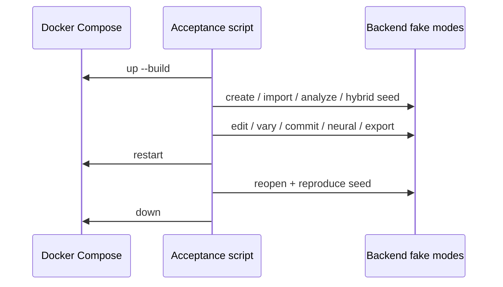

# Implementation Plan: DAW Interoperability & V3 End-to-End Hardening

Branch: none (`git.create_branches: false`; plan authored on `main`)
Created: 2026-09-21

## Settings
- Testing: yes
- Logging: verbose
- Docs: yes
- Planning depth: final, ultra-thorough
- Default prefs source: `.ai-factory/config.yaml` (`plan_testing` / `plan_logging` / `plan_docs` / `plan_link_roadmap`)
- Scope: make **AI Composer V3** usable inside a real external music-production workflow — harden Standard MIDI / MusicXML DAW handoff + drag/download UX; record durable generation provenance (pipeline / models / versions / tokenizer / seed / config) on AI revisions; ship a **Docker-restartable V3 end-to-end acceptance** journey covering multimodal input → hybrid generate → edit → versions → playback → neural audio → export → reopen → seeded symbolic reproduce — **without** inventing proprietary DAW formats, a `composition.v3` schema, expensive CI training, or silent remote API calls

## Roadmap Linkage
Milestone: "DAW interoperability and V3 end-to-end platform hardening"
Rationale: All prior roadmap milestones (through optional neural audio rendering) are complete; V3 AI runtime + hybrid symbolic + multimodal ingress + neural egress exist, but durable hybrid provenance on revisions, DAW-oriented export UX, checkpoint path confinement, and a single restart-safe V3 acceptance gate do not. Add as a new unchecked milestone in `.ai-factory/ROADMAP.md` during docs/implement (roadmap owner: `/aif-roadmap` or docs checkpoint). Prior milestone "Optional neural audio rendering" is already complete.

## Goal

Ship Mukit as a **complete AI-assisted music platform** that (1) hands off scores to Ableton / Reaper / generic SMF workflows via robust multi-track MIDI (+ existing MusicXML), (2) records enough provenance on every AI-generated composition/revision to reproduce seeded symbolic generations when the same checkpoint remains installed, and (3) proves the full Docker → create/import → optional MIDI/audio → analyze → hybrid generate → edit → vary → versions → playback → optional neural render → export → restart → reopen → reproduce path under fake/tiny fixtures.

```text
Composition V2 (authoritative score)
  → [DAW egress] SMF Type 1 + MusicXML + drag/download UX
  → [provenance] pipeline + stages + tokenizer + seed + config on revision summary_json
  → [acceptance] scripts/v3_docker_acceptance.sh + Playwright + pytest fakes
  → V2 schema unchanged; no ALS/RPP/proprietary packs; no composition.v3
```

**Terminology lock:** Product **V3** = unified AI runtime era + full multimodal platform. Canonical playable schema remains **`composition.v2`**. `composition.v3` stays **unsupported** (`classifyCompositionVersion` → unsupported). "Migrations V1 → V2 → V3" means **V1→V2 score migration + V3 platform acceptance**, not a new score schema.

## DAW / Format Evaluation (Part A)

| Target | Mechanism | Local? | License / coupling | Verdict |
|--------|-----------|--------|--------------------|---------|
| **Standard MIDI File (SMF Type 1)** | Existing `composition_midi.render_midi_with_report` | Yes (mido) | Universal | **Primary DAW handoff** — harden + UX |
| **MusicXML 3.x / MXL** | Existing `music_json_renderer` | Yes (music21) | Notation handoff | **Keep** — document as score/notation path |
| **SMF Type 0** | Optional flatten | Yes | Some hardware / older drop targets | **Optional** export flag only if a concrete DAW gap appears in tests; default stays Type 1 |
| **Ableton Live** | Import SMF / drag MIDI clip; no ALS write | N/A | Proprietary ALS | **Workflow docs + SMF validation** — **do not** write `.als` |
| **Reaper** | Import MIDI / media item from SMF; markers; tempo map | N/A | Free/paid; no RPP write | **Workflow docs + SMF markers/tempo** — **do not** write `.rpp` |
| **Browser drag/drop MIDI** | `Download` + `DataTransfer` with `audio/midi` / `.mid` | Yes | Web standards | **Implement** convenient drag + download |
| **Proprietary packs** (ALS, RPP, Logic project, Cubase) | Vendor formats | No | High maintenance / ToS | **Reject** unless a later plan proves unavoidable |

**Locked selection:** Improve **SMF Type 1** fidelity + **MusicXML** labeling + **export UX** (download + drag). Document Ableton/Reaper import recipes. No proprietary writers.

## Provenance Model Evaluation (Part B)

| Approach | Pros | Cons | Verdict |
|----------|------|------|---------|
| **A. Embed full provenance inside `composition.v2` JSON** | Travels with score | Pollutes playable contract; import/export noise; secret risk | **Reject** as primary |
| **B. Revision `summary_json` + session `generationMeta` (extend existing)** | Already on commit path; no Alembic; secret guard exists | Must wire frontend apply + hybrid stages | **Accepted** |
| **C. Separate `generation_runs` SQLite table** | Queryable history | New migration + dual write; overkill for v1 hardening | **Deferred** unless summary_json size limits force it |
| **D. Only API response fields (ephemeral)** | Already mostly present | Lost on restart / version restore | **Insufficient** |

**Decision:** Extend **`AiProvenance.generation_parameters`** (and frontend `generationMeta`) to carry bounded, secret-safe: `pipeline_id`, `stages[]` (model_id, model_version, runtime, capability, operation, seed, tokenizer_version, checkpoint_card_prefix), and a compact `generation_config` digest (temperature/timeout/candidate_count/sample greedy flags — never prompts/keys/absolute paths). Prefer **no Alembic**. Surface in Versions UI as read-only provenance.

## Audit Summary (current state)

### What already exists (reuse)

| Area | Today | Reuse |
|------|-------|-------|
| Multi-track MIDI | `composition_midi.py` SMF Type 1: conductor + per-track | Harden gaps only |
| Track naming | `MetaMessage("track_name")` from `track.name` / id | Keep |
| Channel mapping | `track.channel` 1–16; drums channel 10; shared-channel program/CC conflict checks | Keep + document |
| Program changes | Tick-0 `program_change` per pitched track | Keep; mid-score program changes **out of scope** unless V2 gains timed program events (do not invent) |
| Tempo map | Conductor `set_tempo` from `tempo` + `tempo_changes` | Keep |
| Time-signature map | Conductor `time_signature` from meter timeline | Keep |
| Markers | V2 `markers` → MIDI marker/text meta | Keep |
| Sections | V2 `sections` for UI/nav; **not** duplicated into MIDI markers (by design today) | Optional **export projection** of section labels → markers (lossy, reported) |
| Automation / CC | CC7/10/11/64 + sampled linear lanes | Keep |
| MusicXML | `music_json_renderer` + projection headers | Keep; label as notation handoff |
| Export UI | `ExportControls.jsx` + `downloadFile.js` | Extend with drag-source + clearer DAW copy |
| Generate provenance (API) | `LLMMusicGenerationResponse.pipeline_id` / `stages` / `seed` / tokenizer on stages | Wire into durable revision meta |
| Revision AI fields | `AiProvenance` → `summary_json` via `project_history._ai_fields` | Extend payload; secret guard |
| Hybrid + fake symbolic | `hybrid_plan_symbolic`, `fake:symbolic-tiny`, seed | Reproduce gate |
| Neural audio | `/neural-audio/renders` jobs; fake engine | Optional E2E step |
| Docker accept | `v1_docker_acceptance.sh`, `v2_docker_acceptance.sh` | Pattern for `v3_docker_acceptance.sh` |
| E2E Playwright | Import, analysis, develop, versions, midi live, audio tx, neural, playback | Compose into V3 journey / scripted API gate |
| Tiny fixtures | Fake LLM, fake symbolic, short audio, tiny MT checkpoints under tests/fixtures | CI only |

### Gaps (must build)

| Gap | Notes |
|-----|--------|
| Section → MIDI marker projection | DAWs use markers for form; sections currently navigation-only |
| Drag MIDI UX | Download only; no `draggable` / DataTransfer of `.mid` |
| Ableton / Reaper workflow docs | No operator guide for import expectations |
| Durable hybrid provenance on revisions | API returns stages/seed; `generationMeta` on apply often only `{provider, model, prompt}` — lost after restart |
| Reproduce-from-revision UX/API | No first-class “re-run with same seed/models” helper |
| Checkpoint path confinement | `MUSIC_TRANSFORMER_CHECKPOINT` can resolve arbitrary filesystem paths in web/symbolic path |
| Model install explicitness | Document + enforce: no auto-download on `compose up`; operator mounts weights |
| `v3_docker_acceptance.sh` | No single restart + hybrid + export + reopen + seeded reproduce gate |
| Architecture diagrams | Need final platform diagram (ingress → V2 → AI → egress) |
| Export labeling | MIDI/MusicXML vs Deterministic WAV vs Neural AI already partial; harden DAW-oriented copy |

### Coupling risks to avoid

1. Inventing `composition.v3` or mutating playable notes from markers/sections/harmony.
2. Writing Ableton `.als`, Reaper `.rpp`, or other proprietary project formats.
3. Storing API keys, full prompts, absolute home paths, or raw MIDI bytes in `summary_json`.
4. Silent hybrid → LLM note fallback while claiming symbolic provenance.
5. Auto-downloading model weights on Docker start.
6. Allowing `MUSIC_TRANSFORMER_CHECKPOINT` / neural weight paths to escape configured roots (`MUSIC_TRANSFORMER_CHECKPOINT_DIR`, `models/`, render roots).
7. Making neural audio or local AI required for V3 acceptance (fake modes only in default gate).
8. Growing DAW logic in `main.py` — keep projection in `composition_midi` / export helpers; UX in `ExportControls` + small utils.
9. Blocking Playwright/CI on GPUs, remote LLM credits, or multi-hour training.
10. Treating MusicXML omissions (automation) as MIDI failures — keep projection report codes distinct.
11. Persisting uploaded audio or transcription confidence onto V2 notes.
12. Equating “V3 migration” with a third score schema.

## Approach Evaluation (locked)

### Part A — Export / DAW

| Approach | Pros | Cons | Verdict |
|----------|------|------|---------|
| **A. Rewrite MIDI exporter from scratch** | Clean slate | High regression risk; already solid | **Reject** |
| **B. Harden SMF Type 1 + optional section markers + UX** | Incremental; tests exist | Must keep projection reports honest | **Accepted** |
| **C. Ship Ableton pack / Reaper project writer** | “One-click DAW” | Proprietary; brittle; ToS | **Reject** |
| **D. Client-side only MIDI encode** | No server | Diverges from FluidSynth/WAV shared projection | **Reject** as primary; server remains source of truth |

### Part B — Provenance

| Approach | Pros | Cons | Verdict |
|----------|------|------|---------|
| **Extend revision `summary_json` + generationMeta** | Fits architecture | Frontend + API wiring | **Accepted** |
| New Alembic table | Queryable | Unnecessary for DoD | Deferred |

### Part C — Acceptance

| Approach | Pros | Cons | Verdict |
|----------|------|------|---------|
| **API-heavy `v3_docker_acceptance.sh` + selective Playwright** | Fast, restart-safe, fake mode | Less UI coverage than full SPA click-through | **Accepted** primary gate |
| Single 30-minute Playwright mega-spec | High confidence | Flaky; slow CI | **Optional** smoke only; not required for every PR |
| Require real MusicGen + MT GPU | True production | Blocks CI | **Reject** for automated gate |

## Scope And Decisions

### In scope
- SMF multi-track hardening checklist + tests (naming, channels, programs@0, tempo/meter maps, markers, CC).
- Optional **section-label → MIDI marker** projection with report code (e.g. `section_exported_as_marker`); off-by-default or on-by-default with clear docs — **lock default ON** for DAW convenience, with omission when label empty.
- Export UX: download + **drag `.mid`** (and MusicXML if feasible) from ExportControls; MIME `audio/midi` / `audio/mid`; stable filenames.
- Ableton + Reaper workflow docs (import SMF, markers, tempo; known limits).
- MusicXML handoff docs (notation; automation omitted codes).
- Durable provenance on AI generate/apply commits: pipeline, stages, model versions, tokenizer, seed, bounded generation_config.
- Versions panel / revision detail shows provenance (read-only).
- Seeded symbolic reproduce helper (API or documented curl path) when same fake/tiny or installed checkpoint.
- Path confinement for checkpoint / model roots; explicit install docs; no auto-download.
- `scripts/v3_docker_acceptance.sh` covering the required workflow with fakes.
- Backend/frontend/adapter/tokenizer/symbolic/import-export/persistence/Docker/failure tests.
- Docs + final architecture diagrams (mermaid in docs + plan appendix).
- Roadmap milestone checkbox addition during docs task.

### Out of scope
- `composition.v3` schema.
- Proprietary DAW project writers.
- Mid-track program-change events (no V2 field today).
- Guaranteeing note-perfect generative neural audio.
- Training models in acceptance.
- Replacing FluidSynth / Tone.js.
- Auto-ingesting projects into `DATASET_ROOT`.
- Real-time DAW bridge / WebMIDI output stream (live input already exists separately).

### Architecture decisions (locked)

**1. Score contract stays V2**

```text
composition.v2  →  MIDI / MusicXML / FluidSynth / Tone.js / neural jobs
```

Never invent notes from sections/markers/harmony/provenance.

**2. MIDI projection additions**

| Feature | Behavior |
|---------|----------|
| Sections → markers | For each section with non-empty `label` (else `type`), emit MIDI `marker` at `start_tick` if no identical marker already exists; report `section_exported_as_marker` |
| Program changes | Remain tick-0 only |
| Type 0 | Not default; skip unless a failing DAW workflow forces a follow-up task |

**3. Provenance contract (`generation.provenance.v1` fragment inside `generation_parameters`)**

```json
{
  "provenance_schema": "generation.provenance.v1",
  "pipeline_id": "hybrid_plan_symbolic",
  "seed": 42,
  "stages": [
    {"operation": "generate_planner", "model_id": "fake:fake-v1", "model_version": "…", "runtime": "fake", "capability": "language_planner"},
    {"operation": "generate_composer", "model_id": "fake:symbolic-tiny", "runtime": "fake_symbolic", "capability": "symbolic_composer", "seed": 42, "tokenizer_version": "tokenizer.v1", "checkpoint_card_prefix": null}
  ],
  "generation_config": {
    "sample_greedy": true,
    "max_new_tokens": 128,
    "candidate_count": 1
  }
}
```

Rules: truncate prefixes; basenames only for checkpoints; `persistence_secret_guard` on write; never store prompts/keys.

**4. Path security**

- Resolve `MUSIC_TRANSFORMER_CHECKPOINT` under `MUSIC_TRANSFORMER_CHECKPOINT_DIR` (or configured allowlist roots including Compose `./models/…` mounts).
- Reject `..`, absolute paths outside roots → 422/503 with stable code `model_path_rejected`.
- Same pattern for any operator-supplied neural weight path if exposed via HTTP.
- Logging: basenames only.

**5. V3 acceptance script phases**

1. `docker compose up` (fake env: `LLM_FAKE_MODE`, `AUDIO_FAKE_MODE`, `NEURAL_AUDIO_FAKE_MODE`).
2. Create project + optional MIDI import fixture + optional short audio transcription.
3. Analyze composition.
4. Hybrid generate with fixed seed → capture fingerprint + provenance.
5. Edit note (region or piano-roll API-equivalent composition patch).
6. Development variation preview + apply (or fake development).
7. Commit named revision.
8. Playback readiness (optional: skip Tone in script; assert export MIDI schedulable).
9. Neural audio enqueue → complete → download (fake).
10. Export MIDI + MusicXML; assert multi-track + markers smoke.
11. `compose restart`; reopen project; assert composition + revision provenance.
12. Re-run hybrid with same seed + models → fingerprint match (fake:symbolic-tiny).

**6. Logging**

- MIDI: track counts, codes, duration; never full event dumps at INFO.
- Provenance: pipeline_id, model_ids, seed, stage count at INFO; no prompts.
- Acceptance script: phase markers + timings.
- Path rejects: WARN with code + basename.

## Acceptance criteria mapping

| Criterion | Tasks |
|----------|-------|
| Robust multi-track MIDI + naming/channels/programs/tempo/meter/markers/CC | 1–3 |
| Ableton/Reaper/MusicXML/drag eval + UX | 3–4, 12 |
| No proprietary formats unless justified | 0 (this plan) + 12 |
| Provenance: pipeline/models/versions/tokenizer/seed/config | 5–7 |
| V3 E2E workflow 1–14 | 8–11 |
| Tests frontend/backend/adapters/tokenizer/symbolic/import-export/persistence/Docker/failures/V1→V2 | 9–11 |
| No expensive remote/training in automated tests | 8–11 (fake/tiny) |
| Security: keys, audio, model paths, explicit installs | 6, 10, 12 |
| Docs + architecture diagrams | 12 |
| Definition of done: complete platform | All |

## Commit Plan
- **Commit 1** (tasks 1–3): `feat(export): harden SMF DAW projection and section markers`
- **Commit 2** (tasks 4–5): `feat(export): MIDI/MusicXML drag-download UX for DAW handoff`
- **Commit 3** (tasks 6–7): `feat(provenance): durable hybrid generation provenance on revisions`
- **Commit 4** (tasks 8–9): `feat(security): confine model checkpoint paths for symbolic generate`
- **Commit 5** (tasks 10–12): `test(v3): Docker acceptance, reproduce gate, docs, and diagrams`

## Tasks

### Phase 0: Contracts and evaluation lock

- [x] Task 1: Lock DAW/MIDI projection inventory + gap tests
  Deliverable: Extend `backend/tests/test_composition_midi.py` (and/or new `test_composition_midi_daw.py`) as a **DAW interoperability checklist** asserting Type 1 multi-track, track_name, channel, program@0, tempo map, time_signature map, markers, CC7/10/11/64 presence on the expressive V2 fixture. Document current intentional omissions (no mid-track program changes; automation sampling codes). No behavioral change required unless a checklist item fails — then fix in Task 2.
  LOGGING: DEBUG checklist codes; INFO only on assertion module load skip reasons.
  Files: `backend/tests/test_composition_midi.py` (or new daw test), `docs/composition-v2.md` (cross-link later in Task 12).

### Phase 1: MIDI / DAW hardening

- [x] Task 2: Section → MIDI marker projection
  Deliverable: In `composition_midi.py`, when exporting, project V2 `sections` with usable labels into conductor (or track-0) MIDI `marker` meta at `start_tick`, skipping duplicates already covered by `markers`. Add projection report code `section_exported_as_marker` (and skip code when empty). Preserve rule that sections never invent notes. Update MusicXML only if a parallel rehearsal/mark already exists — do **not** force MusicXML section changes beyond current behavior.
  LOGGING: INFO export with section_marker_count, marker_count, track_count; DEBUG per-section skip reasons; never log full labels beyond truncated length at DEBUG.
  Files: `backend/app/services/composition_midi.py`, `backend/app/services/composition_projection.py` (codes if needed), tests.

- [x] Task 3: Export API response / headers for DAW clients
  Deliverable: Ensure `POST /export/midi` (and MusicXML) continue to expose projection status headers; add optional query/body flag only if needed for section markers (prefer always-on from Task 2). Stable `Content-Disposition` filenames (`{title-or-project}-export.mid`). Confirm CORS exposes projection headers for SPA.
  LOGGING: INFO format, byte_size, projection_status, code list compact; no payload bytes.
  Files: `backend/app/main.py` (export handlers only as needed), tests for headers/filename.

- [ ] Task 4: Frontend drag + download UX
  Deliverable: Extend `ExportControls.jsx` + `downloadFile.js` (or new `exportDrag.js`) so MIDI (and MusicXML if practical) support: (a) existing download, (b) HTML5 drag of a File/Blob with `.mid` and MIME `audio/midi` (fallback `application/octet-stream`). Copy: “For Ableton / Reaper / any DAW — drag or download Standard MIDI”. Keep Deterministic WAV and Neural Audio visually distinct (do not overload Export). Unit tests for drag payload helpers (jsdom-friendly).
  LOGGING: `appLogger` / console debug phases only (format, size, dragstart); never composition JSON.
  Files: `frontend/src/components/ExportControls.jsx`, `frontend/src/utils/downloadFile.js` and/or `exportDrag.js`, tests, light CSS in existing styled-components.

### Phase 2: Provenance & reproducibility

- [ ] Task 5: Bound `generation.provenance.v1` on generate responses → store helpers
  Deliverable: Backend helper to build secret-safe provenance fragment from existing `_build_generation_provenance` + generation_config scalars. Ensure `LLMMusicGenerationResponse` stages include `model_version` when known. Add unit tests for truncation, basename-only checkpoint, secret rejection via `persistence_secret_guard`.
  LOGGING: DEBUG fragment keys present; INFO pipeline_id + stage model_ids + seed; never prompts.
  Files: `backend/app/services/llm_music_generator.py` (or new `generation_provenance.py`), `backend/app/schemas.py` (if needed), `persistence_secret_guard.py` (only if new forbidden keys), tests.

- [ ] Task 6: Frontend `generationMeta` + revision commit wiring
  Deliverable: On generate apply and AI commits, persist `pipeline_id`, `stages`, `seed`, `tokenizer_version` (via stages), `generation_parameters.provenance_schema` into `generationMeta` and through `projectPersistRevision.js` → `AiProvenance`. Fix thin `{provider, model, prompt}` apply path. Versions UI: show compact provenance (pipeline, models, seed) on revision detail without dumping prompts. Tests: store + persist revision helpers.
  LOGGING: info apply with pipeline_id + seed + model_ids; debug stage count.
  Files: `frontend/src/store/musicStore.js`, `frontend/src/utils/projectPersistRevision.js`, `frontend/src/api/musicApi.js`, `ProjectVersionsPanel.jsx` (or revision detail component), tests.

- [ ] Task 7: Seeded reproduce path
  Deliverable: Documented + tested path: given revision provenance with `pipeline_id=hybrid_plan_symbolic`, `seed`, and ready `fake:symbolic-tiny` (or installed MT), re-invoke generate with same pipeline/seed/models and assert composition fingerprint equality under fake mode. Prefer a small backend test + acceptance script step over a large new UI. Optional thin `POST` helper only if existing generate cannot be driven from provenance cleanly — avoid API sprawl.
  LOGGING: INFO reproduce attempt with revision_id, seed, model_ids, fingerprint_prefix match/mismatch; ERROR sanitized on failure.
  Files: backend tests, `scripts/v3_docker_acceptance.sh` (Task 10), docs snippet.

### Phase 3: Security & path confinement

- [ ] Task 8: Confine symbolic / MT checkpoint paths
  Deliverable: Shared `resolve_model_path(user_path, *, allowed_roots)` used by `symbolic_composition_generate` / MT API generate. Reject escapes with stable error code. Env/default roots: `MUSIC_TRANSFORMER_CHECKPOINT_DIR`, optional Compose `models/` mount. Tests: traversal, absolute-outside, symlink-escape if feasible without flaky FS tricks.
  LOGGING: WARN rejects with code + basename; INFO resolved basename when accepted; never absolute home paths at INFO.
  Files: new small helper under `backend/app/services/` or `music_transformer/`, wire `symbolic_composition_generate.py` / `music_transformer_generate.py`, tests, `.env.example` comments.

- [ ] Task 9: Explicit model install + no auto-download policy (code+docs hooks)
  Deliverable: Confirm Compose profiles never curl weights on `up`; add readiness/discovery messages that say “checkpoint not installed” rather than downloading. Audit neural-audio + local-ai docs cross-links. Any download script must be opt-in documented CLI, not imported by FastAPI lifespan.
  LOGGING: `/ready` soft subsections already — keep credentials-present booleans only.
  Files: `docs/local-ai.md`, `docs/music-transformer.md`, `docs/neural-audio-rendering.md` (cross-links in Task 12), compose files only if a dangerous hook exists (remove it).

### Phase 4: V3 end-to-end acceptance

- [ ] Task 10: `scripts/v3_docker_acceptance.sh`
  Deliverable: Opt-in script (`RUN_DOCKER_ACCEPTANCE=1`) mirroring v2 script style: fake modes, health waits, project create, MIDI import fixture, optional audio fixture transcription, analysis POST, hybrid generate+seed, note edit, development preview apply (fake), revision commit, neural fake render, MIDI/MusicXML export assertions (multi-track + marker smoke), compose restart, reopen, seeded reproduce fingerprint match. Tear down volumes unless `KEEP_VOLUME=1`. Must not call paid APIs.
  LOGGING: phase banners + timings to stdout; on failure dump `compose logs --tail`.
  Files: `scripts/v3_docker_acceptance.sh`, mention in `docs/testing.md` / README.

- [ ] Task 11: Automated tests across layers (non-Docker default CI)
  Deliverable: Fill gaps not covered above:
  - Backend: MIDI daw checklist; provenance persist; path reject; hybrid seed reproduce (fake); V1→V2 migrate still green; import/export; neural fake unchanged.
  - Frontend: export drag helper; generationMeta provenance; versions provenance display.
  - Adapter/tokenizer/symbolic: existing tiny fixtures remain green; add reproduce assertion if missing.
  - Failure behavior: 503 when symbolic unavailable without silent LLM fallback; 422 path reject.
  - Optional Playwright: short smoke for export buttons + provenance visible after fake generate (skip if no server) — do not replace Task 10.
  LOGGING: follow existing test logger patterns; verbose under `LOG_LEVEL=DEBUG` in targeted tests only.
  Files: tests under `backend/tests/`, `frontend/src/**/*.test.js`, optional `frontend/e2e/v3-platform-smoke.spec.js`.

### Phase 5: Documentation & diagrams

- [ ] Task 12: Docs, roadmap milestone, architecture diagrams
  Deliverable:
  - New `docs/daw-interoperability.md` (Ableton/Reaper/SMF/MusicXML workflows, limits, drag/download).
  - Update `docs/composition-v2.md` export section (section markers), `docs/hybrid-generation.md` + `docs/ai-runtime.md` (durable provenance), `docs/testing.md` (v3 script), `docs/music-transformer.md` (path roots / no auto-download), `AGENTS.md` + `DESCRIPTION.md` one-liners, `.env.example` comments.
  - Add unchecked roadmap milestone **"DAW interoperability and V3 end-to-end platform hardening"** (or mark complete only after implement/verify).
  - Final architecture diagrams (mermaid) in `docs/daw-interoperability.md` and/or `docs/CODEBASE_MAP.md`: (1) platform flow ingress→V2→AI→egress, (2) provenance persistence, (3) Docker acceptance loop.
  LOGGING: N/A for docs; keep secret policy callouts.
  Files: docs listed, `.ai-factory/ROADMAP.md`, `AGENTS.md`, `.ai-factory/DESCRIPTION.md`, `.env.example`.

## Final architecture diagrams (plan appendix — implementer must paste into docs)

### Platform flow



### Provenance persistence



### V3 Docker acceptance loop



## Definition of done (checklist)

- [ ] DAW SMF checklist green; section markers projected; drag/download UX shipped
- [ ] Ableton/Reaper/MusicXML workflows documented; no proprietary writers
- [ ] AI revisions store pipeline/models/versions/tokenizer/seed/config safely
- [ ] Checkpoint paths confined; installs explicit; keys never logged/persisted
- [ ] `v3_docker_acceptance.sh` passes with fakes including restart + seeded reproduce
- [ ] Normal CI stays free of paid APIs and long training
- [ ] Docs + diagrams landed; roadmap milestone added
