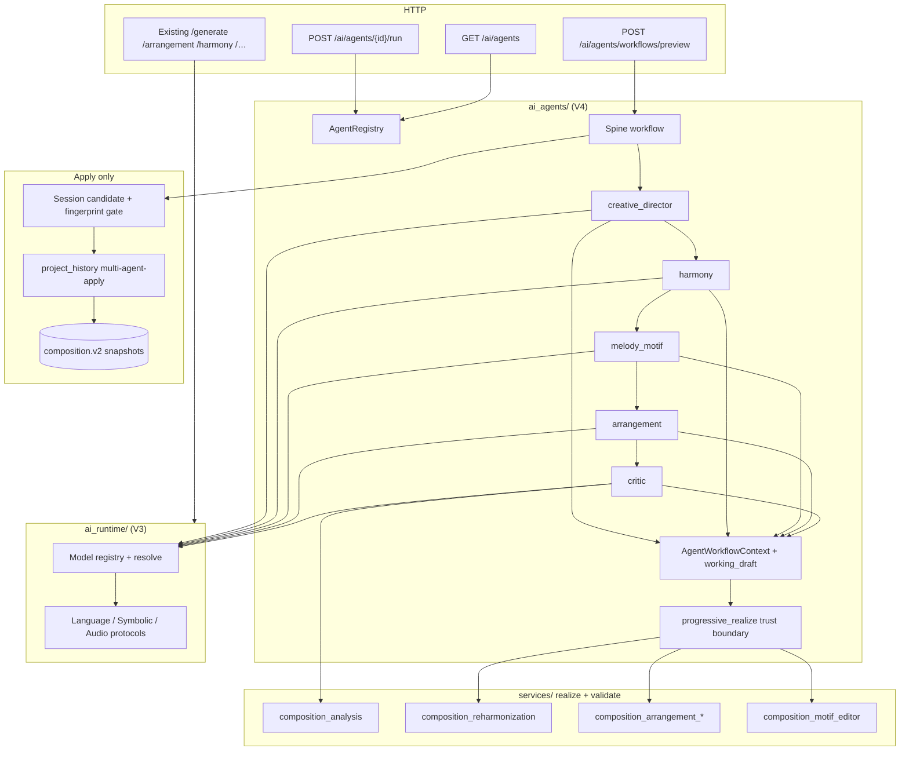

# Implementation Plan: V4 Multi-Agent Music Architecture

Branch: none (`git.create_branches: false`; plan authored on `main`)
Created: 2026-09-21
Improved: 2026-09-22

## Settings
- Testing: yes
- Logging: verbose
- Docs: yes
- Planning depth: final, ultra-thorough
- Default prefs source: `.ai-factory/config.yaml` (`plan_testing` / `plan_logging` / `plan_docs` / `plan_link_roadmap`)
- Scope: replace the assumption of one general-purpose composer workflow with an **extensible set of specialized cooperating music agents** that sit above the V3 AI runtime, return typed non-mutating artifacts, and only change canonical `composition.v2` through the existing preview → Apply → revision CAS path — **without** inventing `composition.v4`, microservices, a giant shared mutable blackboard, or regressing V1–V3 single-operation workflows

## Roadmap Linkage
Milestone: "V4 multi-agent music architecture"
Rationale: All prior roadmap milestones through DAW / V3 platform hardening are complete; V3 provides capability-routed models and hybrid provenance, but orchestration is still fixed LangGraph stages / imperative preview loops rather than selectable specialized agents. Add as a new unchecked milestone in `.ai-factory/ROADMAP.md` during the docs/implement checkpoint (roadmap owner: `/aif-roadmap` or docs task).

## Goal

Ship Mukit as a **multi-agent AI music platform** where Creative Director, Structure/Form, Harmony, Melody/Motif, Arrangement, Orchestration, Performance/Expression, Production, and Critic agents are first-class **capabilities/services** (not apps) that:

1. advertise a common typed interface (id, capability, operations, artifact I/O, required model capabilities, resource/cost hints);
2. invoke models only through the existing `ai_runtime` resolve/provenance path;
3. exchange **typed artifacts** (analysis, plans, recommendations, candidate patches, generated artifacts) rather than hidden prompt strings;
4. never write SQLite / never mutate durable Composition themselves;
5. compose into an optional multi-agent workflow whose **final approved candidate patch** alone lands via the existing revision system.

```text
composition.v2 (authoritative score)
  → [read-only context] AgentWorkflowContext (typed slots + working_draft_composition)
  → CreativeDirector → Harmony → Melody/Motif → Arrangement → Critic
  → typed intermediate artifacts (plans / drafts / critiques)
  → progressive realize into working_draft V2 (deterministic services only)
  → session candidate V2 (+ provenance stages with agent_id)
  → explicit Apply → DurableCommit / ApplyAsBranch (CAS)
  → V2 schema unchanged; V1–V3 single-op routes unchanged
```

**Terminology lock:** Product **V4** = multi-agent orchestration era. Canonical playable schema remains **`composition.v2`**. `composition.v4` stays unsupported. Agents are **in-process services** under `backend/app/`, not separate deployables. LangGraph remains the optional **workflow spine**; agents are node/subgraph implementations, not a replacement for `ai_runtime` models. Agent capability enum is **`MusicAgentCapability`** — never overload `ModelCapability`.

## Agent Capability Inventory (required initial set)

| Agent id | Capability role | Typical model binding (configurable) | Primary produced artifacts | Mutates V2? |
|----------|-----------------|--------------------------------------|----------------------------|-------------|
| `creative_director` | Intent / brief / stage plan / stop criteria | remote or local `language_planner` | `agent.brief.v1`, `agent.workflow_plan.v1`, recommendations | No |
| `structure_form` | Form / sections / density outline | `language_planner` (reuse plan-form patterns) | `composition.plan.v1` form fragment / structure plan | No |
| `harmony` | Harmony timeline / reharm proposals | remote LLM and/or deterministic reharm engine | harmony plan, `candidate_patch` / reharm proposal | No |
| `melody_motif` | Melody + motif recurrence | LLM and/or `symbolic_composer` / motif services | motif/melody drafts, candidate patches | No |
| `arrangement` | Track topology / texture redistribute | existing arrange preview path | `ArrangementCandidate`-shaped candidate | No |
| `orchestration` | Instrument assignment / range / catalog | arrange catalog + LLM draft | orchestration recommendations + candidate patch | No |
| `performance_expression` | Velocity / CC / expression lanes | LLM advisory + deterministic validators | expression recommendations / candidate patch | No |
| `production` | Mix/render intent; neural egress | `audio_generation` (neural) + deterministic WAV out of band | neural job refs / production notes (`mutates_composition: false`) | No |
| `critic` | Quality / constraint / consistency critique | deterministic `composition.analysis.v1` + optional LLM | `agent.critique.v1`, analysis sidecar, approve/revise recommendation | No |

**Acceptance spine (must ship):**  
`creative_director` → `harmony` → `melody_motif` → `arrangement` → `critic`  
with typed intermediates; only the **final approved** candidate modifies canonical Composition via Apply.

Remaining agents (`structure_form`, `orchestration`, `performance_expression`, `production`) ship as registered capabilities with fake/mocked invoke paths and optional workflow slots so the registry is complete without blocking the acceptance spine.

## Approach Evaluation (locked)

### Part A — Where agents live

| Approach | Pros | Cons | Verdict |
|----------|------|------|---------|
| **A. Separate microservice per agent** | Isolation | Ops overhead; contradicts monolith + “capabilities/services”; breaks shared schemas | **Reject** |
| **B. New `ai_agents/` package above `ai_runtime`** | Clear layer; reuse models/provenance; testable | Must not grow god-state | **Accepted** |
| **C. Fold agents into `ModelCapability` enum only** | Minimal code | Confuses models with roles; no artifact bus | **Reject** as sole design |
| **D. Replace LangGraph with ad-hoc agent loop only** | Flexibility | Regresses hybrid/repair graphs; hard to keep V3 pipelines | **Reject** — keep LangGraph as spine for multi-agent workflow; leave existing generate graphs intact |

### Part B — Inter-agent state

| Approach | Pros | Cons | Verdict |
|----------|------|------|---------|
| **A. One large mutable `dict` blackboard** | Easy to hack | Hidden coupling; races; violates req #9 | **Reject** |
| **B. Immutable `AgentWorkflowContext` with typed named slots + `working_draft_composition`** | Explicit; copy-on-write; testable | Slightly more boilerplate | **Accepted** |
| **C. Only HTTP round-trips between agents** | Clear boundaries | Too heavy in-process; loses typed guarantees | **Reject** for in-process workflow |

### Part C — Mutation boundary

| Approach | Pros | Cons | Verdict |
|----------|------|------|---------|
| **A. Agents write `project_store` / history** | Fast | Violates preview-first + CAS; secret/risk | **Reject** |
| **B. Agents return artifacts; Apply uses existing commit path** | Matches arrange/develop/reharm | Requires workflow → candidate envelope | **Accepted** |
| **C. Agents return full V2 always and auto-commit** | Simple UX | Silent mutation; no Critic gate | **Reject** |

### Part D — Discovery

| Approach | Pros | Cons | Verdict |
|----------|------|------|---------|
| **A. Only document agents in markdown** | Cheap | No status/config surface | **Insufficient** |
| **B. `GET /ai/agents` (+ `/{id}`) + `POST /ai/agents/{id}/run` + workflow preview** | Mirrors V3 discovery; independent invoke | Small router addition | **Accepted** |
| **C. Overload `/ai/models` with agent entries** | One endpoint | Confuses models vs agents | **Reject** |

## Audit Summary (current state)

### What already exists (reuse)

| Area | Today | Reuse |
|------|-------|-------|
| Model capability registry | `ai_runtime/` (`ModelCapability`, `AiOperation`, `ModelDescriptor`, resolve + fallback) | Agents **bind** to ops/models; do not fork registry |
| Typed model protocols | `LanguageModel`, `SymbolicMusicModel`, audio/embed protocols | Agents invoke via protocols / existing services |
| Discovery | `GET /ai/models` | Pattern for `GET /ai/agents` |
| LangGraph generate | `llm_music_generator.py` fixed stage graph + hybrid | Keep as V3 path; multi-agent is **additional** pipeline/workflow |
| Plan contract | `composition.plan.v1` | Structure/harmony agent outputs |
| Analysis sidecar | `composition.analysis.v1` | Critic deterministic half |
| Arrange / develop / reharm preview | Stateless candidates + fingerprint gate + session Apply | Arrangement / Harmony agents; Apply pattern |
| Motif apply | Compute-only then FE Apply | Melody/Motif agent |
| Neural audio | Job egress; `mutates_composition: false` | Production agent |
| Provenance | `generation.provenance.v1` stages on revisions | Add `agent_id` / `agent_capability` on stages (**sanitizer + DTO must allow**) |
| Fake modes | `fake_llm`, `fake:symbolic-tiny`, analysis fakes | Mock agents + fake bindings for architecture tests |
| Candidate lifecycle FE | `compositionCandidateLifecycle.js` | Multi-agent session candidate envelope |
| CAS revisions | `DurableCommitRequest` / `ApplyAsBranch` + `AiProvenance` | Sole durable mutation path |
| Forbidden-import gate pattern | `test_dataset_pipeline.py` scans for `project_store` / `PROJECT_DB_PATH` | Reuse for `ai_agents/` package |

### Gaps (must build)

| Gap | Notes |
|-----|-------|
| Agent descriptor + registry | No agent id / artifact I/O / cost surface |
| Typed artifact envelope | Cross-tool candidates exist but no shared agent artifact bus |
| Progressive realize / `working_draft_composition` | Patches must accumulate into fingerprintable V2 via trust-boundary services |
| Immutable workflow context | Generate uses TypedDict blob; not role-scoped slots |
| Multi-agent workflow spine | No CreativeDirector→…→Critic orchestration |
| Agent discovery + single-agent run HTTP | Missing `/ai/agents` and `/ai/agents/{id}/run` |
| Durable `agent_id` on provenance stages | `_sanitize_stage` + `GenerationPipelineStageProvenance` drop unknown fields today |
| Domain error codes | No agent/workflow → HTTP map |
| Per-agent model selection | Ops exist; agent→op→model UI/API binding incomplete |
| Architecture tests with mocked agents | Missing |
| Docs diagram for V4 agent layer | Missing |

### Coupling risks to avoid

1. Inventing `composition.v4` or mutating playable notes from agent briefs/critiques/plans.
2. Letting any agent call `project_store` / `project_history_store` write APIs.
3. Passing freeform prompt strings as the only inter-agent payload.
4. One shared mutable global state dict for workflow.
5. Breaking `llm_only` / `hybrid_plan_symbolic` / arrange/develop/reharm/motif single-op routes.
6. Silent LLM note fallback when Melody agent is bound to symbolic composer (reuse hybrid no-silent-fallback rule).
7. Logging prompts, API keys, full V2 event arrays, or full critique prose at INFO.
8. Growing multi-agent orchestration into `main.py` — prefer `routers/ai_agents.py` + `ai_agents/` + thin services.
9. Requiring GPUs / remote credits for architecture tests (mocked + fake only).
10. Treating Production neural audio as a Composition mutation.
11. Equating Arrangement vs Orchestration agents as identical — share catalog/validation helpers but keep distinct agent ids and artifact kinds.
12. Auto-applying Critic “approve” without user/session Apply when a project is open (preview-first remains).
13. Returning a non-fingerprintable patch as the workflow Apply candidate (final candidate must be V2).
14. Assuming `agent_id` survives provenance write without updating `_sanitize_stage` / stage DTOs.

## Scope And Decisions

### In scope
- `backend/app/ai_agents/` package: descriptors, registry, protocols, artifact schemas, workflow context, progressive realize helpers, orchestrator, fake/mocked agents, domain errors.
- Common typed agent interface + resource/cost characteristics (from model `limits` + agent-local hints).
- Immutable typed artifact passing + `working_draft_composition` progressive realize.
- Multi-agent preview workflow for the acceptance spine; remaining agents registered and invocable in isolation (`POST /ai/agents/{id}/run`).
- `GET /ai/agents` (+ `/{id}`) discovery/status; nginx `/ai/` already proxies (reuse).
- `POST /ai/agents/workflows/preview` returning session candidate + artifact trace + provenance — **no** project write.
- Extend provenance stages with `agent_id` (and optional `agent_capability`); update sanitizer + Pydantic stage DTO; secret-safe.
- `RevisionOperationType.MULTI_AGENT_APPLY = "multi-agent-apply"` (hard requirement).
- Per-agent model binding via existing `resolve_model_for_operation` + env/request overrides (`AI_AGENT_<ID>_MODEL` or request map); Compose/`.env.example` passthrough.
- Architecture tests proving: no persistence writes from agents; typed slots; mocked spine workflow; V2/V3 paths still importable/callable.
- Structured logging + docs (`docs/multi-agent.md` + architecture diagram) + ROADMAP checkbox addition at docs checkpoint.
- Minimal FE: session multi-agent candidate apply reuse of existing envelope helpers; discard competing arrange/develop/reharm candidates on set (**lock: ship thin FE panel or generator option sufficient to Apply one workflow candidate**).

### Out of scope
- `composition.v4` schema.
- Microservices / separate agent processes / message queues.
- Autonomous long-running agent swarms without user Apply.
- Replacing FluidSynth, Tone.js, or V3 hybrid LangGraph generate.
- Training new models for agent roles.
- Fully autonomous Critic→auto-repair loops that commit revisions.
- Real-time DAW bridge.
- Per-token billing systems (cost **hints** only from limits/locality).
- Full Playwright multi-agent SPA journey (API + architecture tests suffice; optional smoke later).
- Expanding the acceptance spine to all nine agents in one graph (registry coverage is enough).

### Architecture decisions (locked)

**1. Layering**

```text
HTTP routers (ai_agents, existing composition routers)
        ↓
ai_agents/  (AgentRegistry, workflow orchestrator, agent implementations)
        ↓
services/   (realize/validate/analysis/arrangement/motif/reharm — trust boundary)
        ↓
ai_runtime/ (model resolve, protocols, provenance fields)
        ↓
persistence only via project_history Apply path (never from agents)
```

**2. Common agent interface (`agent.descriptor.v1`)**

Each registered agent exposes:

| Field | Meaning |
|-------|---------|
| `id` | Stable snake_case id (`harmony`, `critic`, …) |
| `display_name` | UI label |
| `capability` | `MusicAgentCapability` enum (distinct from `ModelCapability` but mappable) |
| `supported_operations` | Agent ops (`plan`, `propose`, `critique`, `realize_draft`, …) |
| `accepted_artifact_types` | e.g. `composition.v2`, `agent.brief.v1`, `composition.plan.v1` |
| `produced_artifact_types` | analysis / plan / recommendation / candidate_patch / generated_artifact kinds |
| `required_model_capabilities` | subset of `ModelCapability` needed when LLM/symbolic/audio is used |
| `resource` | `{locality_preference, estimated_cost_class, parallelizable, uses_gpu?}` from config + bound model `limits` |
| `status` / `health` | ready / unavailable / degraded (based on bound model readiness) |
| `mutates_composition` | always `false` on agent descriptors |

**3. Artifact envelope (`agent.artifact.v1`)**

```json
{
  "artifact_schema": "agent.artifact.v1",
  "artifact_id": "uuid-or-stable-id",
  "kind": "plan|analysis|recommendation|candidate_patch|generated_artifact|critique|brief|workflow_plan",
  "producer_agent_id": "harmony",
  "content_type": "composition.plan.v1|composition.analysis.v1|arrangement.candidate|agent.brief.v1|agent.critique.v1|…",
  "payload": {},
  "source_fingerprint": "edit.v1-fp",
  "parent_artifact_ids": [],
  "provenance": {
    "operation": "…",
    "model_id": "…",
    "runtime": "…",
    "capability": "…",
    "agent_id": "harmony"
  },
  "warning_codes": [],
  "mutates_composition": false
}
```

Rules: payload must be a known schema; no raw prompts; secret guard before any persistence of provenance fragments.

**4. Workflow context (not a blackboard)**

`AgentWorkflowContext` is an immutable Pydantic (or frozen dataclass) object with **named optional slots**:

- `source_composition` (V2 read-only view) + `source_fingerprint`
- **`working_draft_composition`** (V2; starts as deep copy of source; only updated via progressive realize)
- `brief`, `workflow_plan`
- `structure_plan`, `harmony_artifact`, `melody_artifact`, `arrangement_candidate`
- `orchestration_artifact`, `expression_artifact`, `production_artifact`
- `critique`, `analysis`
- `artifact_log` (append-only tuple of envelopes)
- `bound_models` (agent_id → resolved model public fields)
- `revise_count`, `recommendation` (`approve`|`revise`|null)

Updates: `context.with_slot(name, artifact) → new context` and `context.with_working_draft(v2) → new context`. Agents never mutate prior slots in place.

**5. Progressive realize (trust boundary)**

Each spine agent may emit plans/patches/recommendations, but any update to `working_draft_composition` MUST go through existing deterministic realize/validate services (`composition_reharmonization` / arrangement patch+validation / motif apply / composition validator — adapters, not rewrites). Never invent notes from `brief`, `critique`, `plan`, `sections`, or `harmony` metadata alone. Final workflow HTTP candidate = fingerprintable V2 from `working_draft_composition` (or arrangement candidate’s realized composition assigned into the draft).

**6. Agent protocol**

```text
MusicAgent.run(request: AgentRunRequest) -> AgentRunResult
  AgentRunRequest: agent_id, operation, context snapshot, selection overrides
  AgentRunResult: artifacts[], updated_context_slots{}, working_draft_update?, provenance_stage, warning_codes
```

**7. Multi-agent workflow**

Prefer LangGraph `StateGraph` whose state is **only** serializable workflow context fields + control flags. If LangGraph state friction blocks immutability tests, a sequential orchestrator with the same node order is acceptable for v1.

Default acceptance graph (fixed, deterministic order for tests):

```text
creative_director → harmony → melody_motif → arrangement → critic → END
```

- `max_revisions` default **0** for acceptance (no loop).
- If `max_revisions > 0` and Critic returns `revise`, re-enter at **`harmony`** (not creative_director); increment `revise_count`; exhaust → stable error `workflow_revise_exhausted` (still no commit).
- Critic `approve` does **not** persist; client Apply required.

**8. Model binding**

| Agent | Default AiOperation / path |
|-------|----------------------------|
| creative_director, structure_form | `generate_planner` / language |
| harmony | `reharmonize_ai` and/or deterministic engine |
| melody_motif | `generate_composer` and/or `creative_motif` |
| arrangement / orchestration | `arrange_preview` |
| performance_expression | language advisory + deterministic validators |
| production | `audio_render` (optional; skip in fake workflow if unused) |
| critic | analysis service + optional language |

Request may pass `agent_model_overrides: {agent_id: model_id}`. Env: `AI_AGENT_<AGENT_ID>_MODEL`. When `LLM_FAKE_MODE=1`, bootstrap binds **fake agents/models** automatically. Never silent fallback beyond existing `AI_FALLBACK_*`. Melody/symbolic path must not silently fall back to LLM notes (mirror hybrid rule).

**9. Provenance**

Extend stage objects **and** allow-lists:

```json
{
  "operation": "agent_harmony_propose",
  "agent_id": "harmony",
  "agent_capability": "harmony",
  "model_id": "openai:…",
  "runtime": "openai_compatible_chat",
  "capability": "symbolic_editor",
  "model_version": "…"
}
```

Must update `generation_provenance._sanitize_stage`, `GenerationPipelineStageProvenance`, and raise `_MAX_STAGES` if needed (spine + one revise ≤ ~12; keep ≤ 16 or bump with tests). Pipeline id: `agent_spine_v1` (alias `multi_agent_v4` in docs ok). Attach via `attach_provenance_fragment`.

**10. Keep V2/V3 working**

- No behavior change to existing generate/edit/arrange/develop/reharm/motif/neural routes unless additive provenance fields.
- **Lock: dedicated `POST /ai/agents/workflows/preview`**; do not change default `/generate` pipeline.
- Also: `POST /ai/agents/{id}/run` for independent agent invoke.

**11. Apply / revision**

- Hard-require `RevisionOperationType.MULTI_AGENT_APPLY = "multi-agent-apply"`.
- FE: `buildAiCandidateEnvelope` with that `operation_type`; fingerprint gate; on set discard competing arrangement/development/reharm session candidates.

**12. Logging**

- INFO: workflow_id, agent_id, artifact kind/content_type, model_id, duration_ms, warning code counts, recommendation.
- DEBUG: slot names updated, parent_artifact_ids, fingerprint prefixes.
- Never: prompts, API keys, full payloads, full event arrays, absolute weight paths.

**13. Domain errors (stable codes)**

| Code | Typical HTTP |
|------|----------------|
| `agent_not_found` | 404 |
| `agent_unavailable` | 503 |
| `artifact_kind_rejected` | 422 |
| `workflow_timeout` | 504/503 |
| `workflow_revise_exhausted` | 422 |
| `agent_model_unresolved` | 422/503 |
| `working_draft_invalid` | 422 |

Never leak prompts in `detail`.

## Acceptance criteria mapping

| Criterion | Tasks |
|----------|-------|
| Inspect existing LangGraph/runtime before design | 0 (this plan audit) + Task 1 inventory tests |
| Agents as capabilities/services | 2–4, 8 |
| Common typed agent interface | 2–4 |
| Progressive realize; no note invention from metadata | 3, 7–8 |
| No direct Composition mutation; typed returns | 2–5, 7–9, 12–13 |
| Changes via canonical mutation/revision | 9 |
| Independently selectable/configurable models + single-agent run | 4, 8, 10–11 |
| Provenance per agent operation (`agent_id` durable) | 6, 8–9 |
| Typed artifact context passing | 2–3, 7 |
| No enormous shared mutable state | 2–3, 7, 13 |
| V2/V3 single-op workflows preserved | 1, 12–13 |
| Agent discovery/status | 10 |
| Architecture tests with mocked agents | 13 |
| Spine CreativeDirector→Harmony→Melody→Arrangement→Critic | 7–9, 13 |
| Tests + structured logging + architecture docs | 13–14 |

## Commit Plan
- **Commit 1** (tasks 1–6): `feat(ai-agents): schemas, registry, progressive realize, provenance agent_id`
- **Commit 2** (tasks 7–8): `feat(ai-agents): spine workflow and agent adapters`
- **Commit 3** (tasks 9–11): `feat(ai-agents): preview/apply, discovery, and single-agent run`
- **Commit 4** (tasks 12–14): `test(ai-agents): architecture gates, fakes, docs, and roadmap`

## Tasks

### Phase 0: Contracts and inventory lock

- [x] Task 1: Lock V3 integration inventory + non-regression anchors
  Deliverable: Add focused tests that document current invariants the V4 layer must not break: (a) `GET /ai/models` still lists fake models; (b) `llm_only` and `hybrid_plan_symbolic` still return V2 + provenance without requiring `agent_id`; (c) arrangement/development/reharm preview endpoints remain stateless (no project write). Create a short “V4 must-not-break” checklist comment or module docstring in the new package stub. No agent behavior yet beyond package skeleton if needed for import. (Pre-impl anchors — Task 12 re-runs after wiring.)
  LOGGING: DEBUG checklist item ids; INFO skip reasons only.
  Files: `backend/tests/test_ai_agents_inventory.py` (new), optional `backend/app/ai_agents/__init__.py` package stub, references to existing `test_ai_runtime_registry.py`, `test_generation_pipeline_options.py`.

### Phase 1: Agent contracts, registry, provenance

- [x] Task 2: Define agent / artifact / context schemas
  Deliverable: Pydantic contracts for `MusicAgentCapability`, `AgentDescriptor`, `AgentArtifactV1`, `AgentRunRequest` / `AgentRunResult`, `AgentWorkflowContext` (immutable `with_slot` / `with_working_draft`), resource/cost hint model. Payload schemas: `agent.brief.v1`, `agent.workflow_plan.v1`, `agent.critique.v1` (`recommendation`: `approve`|`revise`; bounded reason codes + truncated text). Enumerate artifact kinds and content_type allow-list; reject unknown kinds. Ensure `mutates_composition` is always false on agent results. Context slots include `source_composition`, `source_fingerprint`, `working_draft_composition`, artifact slots, `revise_count`, `recommendation`. Unit-test validation + immutability.
  LOGGING: INFO schema load counts; DEBUG reject codes; never log payload bodies at INFO.
  Files: `backend/app/ai_agents/schemas.py`, tests `backend/tests/test_ai_agents_schemas.py`.
  Depends on: Task 1 (package stub optional).

- [x] Task 3: Lock progressive realize contract for working draft
  Deliverable: Helper module documenting and enforcing: `working_draft_composition` starts as a deep copy of source V2; agents may only replace it via wrappers around existing deterministic realize/validate services (reharm preview apply-to-draft, arrangement patch+validation, motif apply, composition validator). Reject paths that invent notes from brief/critique/plan/harmony metadata. Tests: patch→realize updates draft fingerprint; metadata-only “realize” raises `working_draft_invalid` / rejected.
  LOGGING: INFO realize service name + fingerprint prefixes; DEBUG skip/reject reasons; never full event arrays.
  Files: `backend/app/ai_agents/progressive_realize.py`, tests `backend/tests/test_ai_agents_progressive_realize.py`.
  Depends on: Task 2.

- [x] Task 4: Agent registry, protocol, and model binding
  Deliverable: `MusicAgent` protocol (`run`), in-process `AgentRegistry` with reload for tests, bootstrap registering all nine agent descriptors (status may be `ready` with fake bindings). Resolve bound model via `resolve_model_for_operation` + `AI_AGENT_<ID>_MODEL` / request overrides. When `LLM_FAKE_MODE=1`, bind fake agents/models automatically. Surface `resource` from descriptor + model `limits`/`locality`. Forbidden-import gate mirroring `test_dataset_pipeline.py`: scan `ai_agents/` for `from app.services.project_store`, `project_history`, and `PROJECT_DB_PATH` references.
  LOGGING: INFO register agent_id + status + bound model_id; WARN unavailable bindings; never log secrets.
  Files: `backend/app/ai_agents/registry.py`, `protocols.py`, `bootstrap.py`, `binding.py`, tests `test_ai_agents_registry.py`.
  Depends on: Task 2.

- [x] Task 5: Domain error codes and HTTP mapping helpers
  Deliverable: Stable error codes (`agent_not_found`, `agent_unavailable`, `artifact_kind_rejected`, `workflow_timeout`, `workflow_revise_exhausted`, `agent_model_unresolved`, `working_draft_invalid`, …) with exception types and router mapping to 4xx/5xx; sanitized `detail` (no prompts). Unit-test code → status mapping.
  LOGGING: WARN/ERROR with code + agent_id/workflow_id only.
  Files: `backend/app/ai_agents/errors.py`, tests `test_ai_agents_errors.py`.
  Depends on: Task 4.

- [x] Task 6: Durable `agent_id` on generation provenance stages
  Deliverable: Extend `generation_provenance._sanitize_stage` allow-list for `agent_id` (+ optional `agent_capability`); extend `GenerationPipelineStageProvenance` in `schemas.py`; cover secret guard + round-trip tests so stages survive `attach_provenance_fragment` into revision-shaped payloads. Adjust `_MAX_STAGES` only if tests prove spine+revise exceeds 16.
  LOGGING: DEBUG stage field presence; INFO stage count; never prompts.
  Files: `backend/app/services/generation_provenance.py`, `backend/app/schemas.py`, `backend/tests/test_generation_provenance.py` (extend), optional `test_ai_agents_provenance.py`.
  Depends on: Task 2.

### Phase 2: Spine agents and workflow

- [x] Task 7: Implement immutable workflow orchestrator + acceptance spine
  Deliverable: LangGraph (or sequential orchestrator if state friction blocks immutability tests) running fixed order: creative_director → harmony → melody_motif → arrangement → critic. Each node calls registry agent; merges artifacts via `with_slot`; updates `working_draft_composition` only via Task 3 helpers; appends to `artifact_log`. `max_revisions` default **0**; if >0 and Critic says revise, re-enter at **harmony**. Returns fingerprintable final V2 candidate + artifact trace + provenance stages (with `agent_id`). No DB writes. Exhausted revise → `workflow_revise_exhausted`.
  LOGGING: INFO workflow start/end, agent_id sequence, artifact counts, recommendation, duration_ms; DEBUG per-slot updates (names only).
  Files: `backend/app/ai_agents/workflow.py`, `backend/app/ai_agents/spine.py`, tests `test_ai_agents_workflow.py` with mocks.
  Depends on: Task 2, Task 3, Task 4, Task 5.

- [x] Task 8: Implement agent adapters (fake + real service wrappers)
  Deliverable:
  - (a) **Fake agents** for all nine ids first (deterministic artifacts; CI default; auto-bound under `LLM_FAKE_MODE=1`).
  - (b) **Spine real adapters**: CreativeDirector (language brief/plan), Harmony (wrap reharm preview into artifacts + progressive realize), Melody/Motif (wrap motif/symbolic/LLM draft — **no silent LLM note fallback** when symbolic binding is required), Arrangement (wrap arrangement preview candidate into draft), Critic (analysis + optional bounded LLM → `agent.critique.v1`).
  - (c) Stub/ready adapters for structure_form, orchestration, performance_expression, production (production optional neural job refs; always `mutates_composition: false`).
  Provenance stage includes `agent_id` for every invoke.
  LOGGING: INFO agent_id, operation, model_id, artifact kind; DEBUG warning_codes; never prompts or full analysis report at INFO.
  Files: `backend/app/ai_agents/agents/*.py`, `fake_agents.py`, thin wrappers calling existing services; tests per adapter with mocks.
  Depends on: Task 2, Task 3, Task 4, Task 6.

### Phase 3: HTTP, Apply, discovery

- [x] Task 9: Multi-agent workflow preview + Apply landing
  Deliverable: `POST /ai/agents/workflows/preview` accepting source `CompositionV2`, optional brief, agent_model_overrides, workflow id (`agent_spine_v1`), optional `max_revisions` (default 0). Response: artifact_log, critique, `candidate` (fingerprintable V2 + fingerprints compatible with `buildAiCandidateEnvelope`), `generation_parameters` / stages with `agent_id`, `mutates_composition: false`. Hard-require `RevisionOperationType.MULTI_AGENT_APPLY = "multi-agent-apply"`. Frontend: thin panel or generator option; Apply via envelope + CAS; **discard competing** arrangement/development/reharm session candidates when multi-agent candidate is set. Fingerprint gate required.
  LOGGING: INFO route, workflow_id, agent sequence length, candidate fp prefix; no composition dump.
  Files: `backend/app/routers/ai_agents.py`, wire in `main.py` router include, `project_history_schemas.py` (`MULTI_AGENT_APPLY`), `frontend/src/api/musicApi.js`, thin UI + `musicStore` apply helper, tests `test_ai_agents_routes.py`, FE unit tests for envelope mapping.
  Depends on: Task 5, Task 6, Task 7, Task 8.

- [x] Task 10: Agent discovery/status API
  Deliverable: `GET /ai/agents` and `GET /ai/agents/{id}` returning descriptors (id, capability, operations, artifact types, required model capabilities, resource, status, bound model public fields). Filter query params: `capability`, `status`. Never expose keys/paths/prompts. Confirm nginx `/ai/` covers `/ai/agents`. Document `.env.example` + `docker-compose.yml` passthrough for `AI_AGENT_<ID>_MODEL`. Optional soft `/ready` `ai_agents` subsection (non-failing, like `local_ai`) — nice-to-have only if cheap.
  LOGGING: INFO list count; DEBUG filter params.
  Files: `backend/app/routers/ai_agents.py`, DTO section in `ai_agents/schemas.py`, tests `test_ai_agents_discovery.py`, `.env.example`, `docker-compose.yml` as needed.
  Depends on: Task 4.

- [x] Task 11: Single-agent invoke API
  Deliverable: `POST /ai/agents/{id}/run` accepting operation, context snapshot (or source V2 + prior artifacts), selection overrides. Returns `AgentRunResult` artifacts only; `mutates_composition: false`; never writes projects. Covers independent Harmony/Critic/etc. selection (requirement 6). Fake-mode tests for at least two agents.
  LOGGING: INFO agent_id, operation, duration_ms; DEBUG artifact kinds.
  Files: `backend/app/routers/ai_agents.py`, tests `test_ai_agents_run_route.py`.
  Depends on: Task 4, Task 5, Task 8, Task 10.

### Phase 4: Hardening, docs, roadmap

- [x] Task 12: Preserve V2/V3 single-operation workflows
  Deliverable: Post-wiring regression tests that existing generate (llm_only + hybrid fake), arrange preview, reharm preview, development preview, motif apply, `/ai/models`, neural audio job flag still pass with `ai_agents` package installed. Ensure default `/generate` does not require multi-agent. Agent bootstrap must be lazy or fail-soft (no startup crash when optional models missing).
  LOGGING: INFO regression module pass markers only.
  Files: `backend/tests/test_ai_agents_compat_v3.py`, startup bootstrap in lifespan/`bootstrap.py` — keep side-effect light.
  Depends on: Task 9, Task 10.

- [x] Task 13: Architecture tests with mocked agents
  Deliverable: Tests that:
  1. Mocked spine produces typed artifacts in order CreativeDirector→Harmony→Melody→Arrangement→Critic;
  2. Forbidden-import / monkeypatch proves no persistence writes from `ai_agents/`;
  3. Workflow context immutability under sequential updates;
  4. Critic approve yields candidate; only simulated Apply changes composition identity in a commit test double;
  5. Provenance stages include durable `agent_id` for each hop after Task 6 sanitizer;
  6. Unknown artifact kind rejected;
  7. Per-agent model override affects resolve (mocked registry);
  8. Progressive realize rejects metadata-only note invention.
  Use fakes only — no remote network.
  LOGGING: DEBUG mock call order; INFO architecture gate summary.
  Files: `backend/tests/test_ai_agents_architecture.py`, fixtures under `backend/tests/fixtures/ai_agents/` if needed.
  Depends on: Task 3, Task 6, Task 7, Task 8.

- [x] Task 14: Documentation, diagrams, roadmap milestone
  Deliverable: Add `docs/multi-agent.md` (layering, agent table, artifact envelope, progressive realize, workflow spine, discovery, single-agent run, Apply rules, error codes, logging/security). Update `docs/ai-runtime.md` with “agents sit above models” cross-link; `docs/CODEBASE_MAP.md` / `AGENTS.md` / `.ai-factory/ARCHITECTURE.md` with `ai_agents/` module; mermaid diagram (ingress → agents → artifacts → working draft → Apply → V2). Add unchecked roadmap milestone “V4 multi-agent music architecture” (completion checkbox is for `/aif-implement` / `/aif-verify`). Update `.ai-factory/DESCRIPTION.md` core features bullet for V4 multi-agent.
  LOGGING: N/A for docs; ensure code examples omit secrets.
  Files: `docs/multi-agent.md`, `docs/ai-runtime.md`, `docs/CODEBASE_MAP.md`, `AGENTS.md`, `.ai-factory/ARCHITECTURE.md`, `.ai-factory/ROADMAP.md`, `.ai-factory/DESCRIPTION.md`, `README.md` short link if appropriate.
  Depends on: Task 9–13 (docs can draft earlier; finalize after).

## Definition of Done

- [x] Nine agents registered and discoverable via `GET /ai/agents`
- [x] Single-agent `POST /ai/agents/{id}/run` works under fake mode
- [x] Acceptance spine workflow preview returns typed artifact_log + fingerprintable candidate without writing projects
- [x] Apply of final candidate uses `multi-agent-apply` CAS + provenance with durable `agent_id` stages
- [x] Progressive realize never invents notes from non-playable metadata
- [x] Architecture tests with mocked agents green under fake mode
- [x] V2/V3 single-op routes unchanged in behavior
- [x] Docs + architecture diagram published; roadmap milestone added

## Appendix A — Target architecture diagram



## Appendix B — Example typed handoff (acceptance spine)

```text
source V2 → working_draft = copy(source)
        ↓
creative_director.produced:
  agent.brief.v1 + agent.workflow_plan.v1
        ↓
harmony.accepted: brief + working_draft
harmony.produced: candidate_patch | reharm proposal
  → progressive_realize → working_draft'
        ↓
melody_motif.accepted: brief + harmony artifact + working_draft'
melody_motif.produced: candidate_patch | generated_artifact
  → progressive_realize → working_draft''
        ↓
arrangement.accepted: prior artifacts + working_draft''
arrangement.produced: ArrangementCandidate-shaped generated_artifact
  → progressive_realize → working_draft'''
        ↓
critic.accepted: working_draft''' + plans + source fingerprint
critic.produced: composition.analysis.v1 + agent.critique.v1 (approve|revise)
        ↓
HTTP response: artifact_log + candidate=working_draft''' (session only)
        ↓
User Apply → DurableCommit operation_type=multi-agent-apply (only mutation)
```

## Appendix C — Improvement notes (2026-09-22)

Applied `/aif-improve` refinements:
- Added progressive realize / `working_draft_composition` contract (Task 3)
- Added domain error codes (Task 5)
- Added durable provenance `agent_id` sanitizer/DTO work (Task 6)
- Added single-agent `POST /ai/agents/{id}/run` (Task 11)
- Locked `max_revisions=0`, revise re-entry at harmony, `MULTI_AGENT_APPLY`, fake-mode binding, no silent LLM note fallback
- Explicit dependencies and commit regrouping for 14 tasks
- Deferred: Playwright mega-journey; nine-agent full spine expansion
