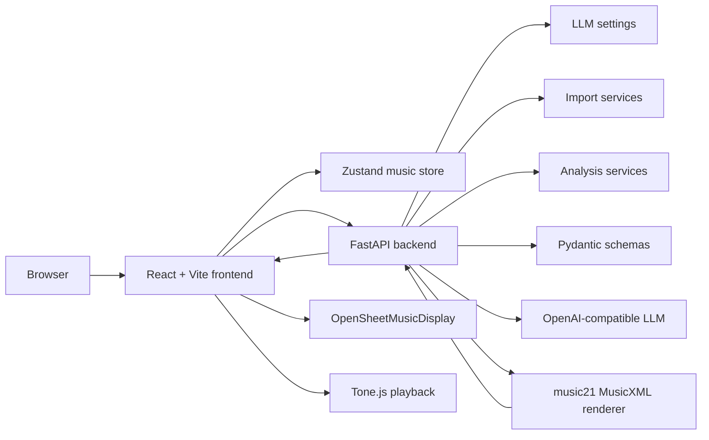
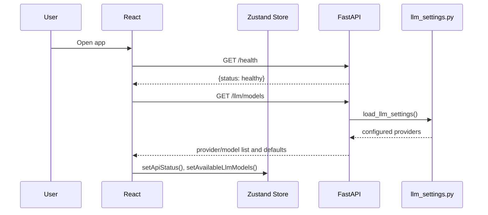
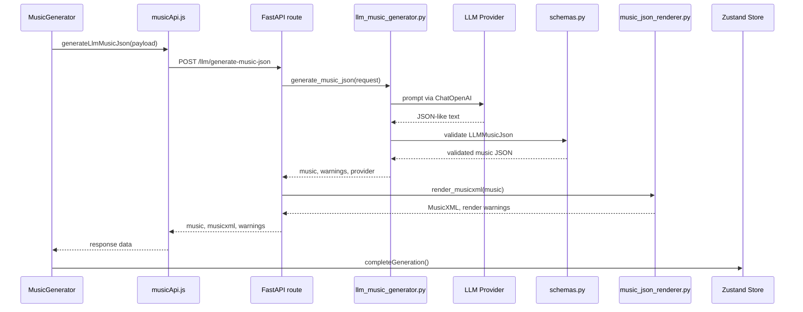
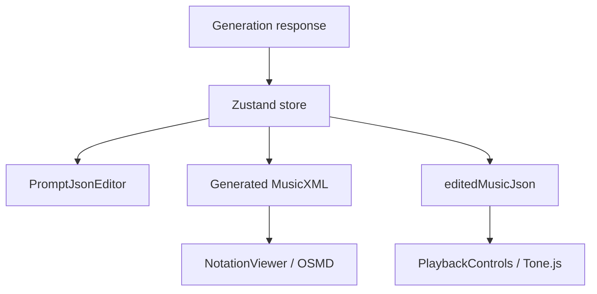

[← Testing](testing.md) · [Back to README](../README.md)

# Codebase Map

> Auto-generated by Cartographer. Last mapped: 2026-08-18T19:44:06Z
>
> **Composition contract (2026-09):** Operational canonical is `composition.v2` (`backend/app/composition_schemas.py`, `docs/composition-v2.md`). V1 remains migration input (`docs/composition-v1.md`). Derived analysis is `composition.analysis.v1` (`docs/composition-analysis.md`) — not part of canonical V2. Context-aware continuation/variation: `docs/composition-development.md` (`POST /composition/development/preview`). Arrangement / orchestration: `docs/composition-arrangement.md` (`GET /composition/arrangement/instruments`, `POST /composition/arrangement/preview`; catalog IDs/ranges are not persisted in V2). Piano-roll editor workflow: `docs/composition-editor.md` (`frontend/src/components/piano-roll/`, `compositionEditor*`, `editorNavigation`, `playbackLoop`). **Safe AI preview / versioning (2026-09):** durable revisions & branches live in SQLite via `project_history*` + `composition_snapshot_encoding` (`docs/project-persistence.md`); UI `ProjectVersionsPanel` / Versions tab; Apply-as-branch and restore-as-child.

## System Overview

Mukit AI is a full-stack AI music composer. A React/Vite frontend collects prompt parameters, imports MIDI/MusicXML, discovers configured LLM providers, posts generation and analysis requests to a FastAPI backend, renders returned MusicXML with OpenSheetMusicDisplay, and plays edited JSON through Tone.js. The backend validates prompt input with Pydantic, loads LLM provider settings from environment variables, converts uploads to `composition.v2`, runs deterministic musical analysis as a sidecar, calls OpenAI-compatible models through LangChain/LangGraph, validates music JSON, and renders MusicXML with music21.



## Directory Structure

```text
backend/                     FastAPI backend, LLM generation, import, MusicXML rendering, tests
  app/
    main.py                  API routes, CORS, endpoint error mapping
    schemas.py               Pydantic request/response/music JSON validation
    import_schemas.py        Import report/issue DTOs and error codes
    import_settings.py       IMPORT_* limits
    analysis_schemas.py      composition.analysis.v1 DTOs / warning codes
    arrangement_schemas.py   Arrangement preview / catalog DTOs
    motif_schemas.py         Motif apply request/response DTOs
    llm_settings.py          Environment-driven OpenAI/DeepSeek config
    routers/
      projects.py            Project CRUD
      imports.py             MIDI / MusicXML multipart import
      analysis.py            POST /analysis/composition
      motifs.py              POST /motifs/apply
      arrangement.py         GET/POST /composition/arrangement/*
      composition_development.py  POST /composition/development/preview
      harmony.py             POST /harmony/reharmonize/preview
    services/
      llm_music_generator.py Prompt construction, LangGraph workflow (incl. plan_themes/realize_themes), LLM JSON validation
      composition_theme.py   Theme plan validation and mechanical recurrence realization
      composition_motif_editor.py / composition_motif_transform.py / llm_motif_editor.py
      composition_import.py  Shared source → V2 canonicalization
      composition_midi_import.py
      composition_musicxml_import.py
      composition_analysis.py Deterministic analysis orchestrator + LLM advisory projection
      composition_fingerprint.py
      instrument_catalog.py  Curated arrangement GM catalog + fingerprints
      composition_arrangement_*.py / llm_composition_arrangement.py
      music_json_renderer.py music21 conversion from validated JSON to MusicXML
  tests/                     Backend unit tests (incl. fixtures/import/ and fixtures/analysis/)
  Dockerfile                 Backend development/runtime image
  requirements.txt           Python dependencies
frontend/                    React/Vite client app
  src/
    api/musicApi.js          Axios backend client (incl. import + analyze + arrange + applyMotif)
    store/musicStore.js      Zustand global state (incl. completeImport + analysis + arrangement preview)
    components/              Header, import, analysis, motifs, arrangement, generation, JSON editor, notation, playback
    utils/compositionAnalysis.js  Scope/freshness helpers
    utils/compositionArrangementCandidates.js  Arrangement normalize / Apply verify
    utils/compositionMotifs.js    Canonical motif reference helpers
    App.jsx                  App shell and startup API status/model discovery
    main.jsx                 Active Vite entry point
  e2e/                       Playwright journeys (incl. arrangement-workflow)
  package.json               Active frontend package/scripts
  vite.config.js             Vite server/proxy config (incl. /imports, /analysis, /motifs, /composition)
  Dockerfile                 Frontend dev container image
docs/
  composition-v2.md          Canonical V2 contract
  composition-development.md Continuation / variation preview
  composition-arrangement.md Arrangement / orchestration preview
  composition-analysis.md    Deterministic analysis sidecar
  import.md                  MIDI/MusicXML ingestion
  testing.md                 Backend test and frontend smoke-test guide
  CODEBASE_MAP.md            This map
.ai-factory/                 AI Factory project metadata and implementation plans
.agents/skills/              OpenCode/AI Factory skills, including cartographer
.codex/skills/               Codex skill pack copy
.cursor/skills/              Cursor skill pack copy
docker-compose.yml           Production-local compose (API + nginx SPA, named volume, healthchecks)
compose.dev.yml              Optional Vite/uvicorn reload override
.env.example                 Documented env template (LLM keys + IMPORT_* limits)
start-servers.sh             Local helper script to start both servers
README.md                    Primary project documentation
```

The `.agents/skills`, `.codex/skills`, and `.cursor/skills` trees dominate the repository token count. They are duplicated AI assistant instruction packs and support tooling, not application runtime code.

## Module Guide

### Backend API

**Purpose**: Expose health, model discovery, and prompt-to-music generation endpoints.

**Entry point**: `backend/app/main.py`

**Key files**:

| File | Purpose | Tokens |
|------|---------|--------|
| `backend/app/main.py` | FastAPI app, CORS, route handlers, exception mapping | 1089 |
| `backend/app/schemas.py` | Pydantic models and cross-field validation | 2531 |
| `backend/app/llm_settings.py` | LLM provider loading from env vars | 1099 |
| `backend/run.py` | Local uvicorn runner | 71 |

**Key routes**: `GET /`, `GET /health`, `GET /llm/models`, `POST /llm/generate-music-json`.

**Dependencies**: FastAPI, Pydantic, Uvicorn, LangChain/LangGraph service layer, music21 renderer.

**Dependents**: Frontend API client in `frontend/src/api/musicApi.js`, backend tests, Docker/compose runtime.

**Environment**: `OPENAI_API_KEY`, `OPENAI_MODEL`, `DEEPSEEK_API_KEY`, `DEEPSEEK_MODEL`, `DEEPSEEK_BASE_URL`, `DEFAULT_LLM_PROVIDER`, `LLM_REQUEST_TIMEOUT_SECONDS`, `LLM_TEMPERATURE`.

### Backend Schemas

**Purpose**: Define and validate the request, response, provider, prompt, and generated music JSON contracts.

**Entry point**: `backend/app/schemas.py`

**Exports**: `LLMMusicGenerationRequest`, `LLMMusicGenerationResponse`, `LLMMusicJson`, `LLMPromptParameters`, `LLMModelSelection`, `LLMGenerationOptions`, `LLMModelsResponse`.

**Validation**: Enforces tempo range, key format, time signature format, supported section/track roles, valid bar/track references, pitch format, and note duration fitting within a measure.

**Gotchas**: Provider literals only include `openai` and `deepseek`; adding a provider requires schema and settings changes. Drum/percussion data is still pitch-based. Rhythmic completeness and note overlaps are not fully validated.

### LLM Generation Service

**Purpose**: Turn a validated prompt into validated music JSON using a LangGraph workflow and OpenAI-compatible chat models.

**Entry point**: `backend/app/services/llm_music_generator.py`

**Key files**:

| File | Purpose | Tokens |
|------|---------|--------|
| `backend/app/services/llm_music_generator.py` | Provider selection, prompt building, graph invocation, JSON extraction/validation | 2677 |
| `backend/app/llm_settings.py` | Provider/model/API key config | 1099 |
| `backend/app/schemas.py` | Input/output validation | 2531 |

**Exports**: `generate_music_json`, `LLMGenerationError`, `NoLLMProviderConfiguredError`, `UnsupportedLLMProviderError`, `InvalidLLMOutputError`.

**Dependencies**: `langgraph`, `langchain_openai.ChatOpenAI`, `pydantic.ValidationError`, backend schemas/settings.

**Gotchas**: Retries only invalid JSON/schema output, not provider/API errors. JSON extraction uses first `{` and last `}`, so unrelated braces in model text can break parsing. DeepSeek is handled through the OpenAI-compatible client with a custom base URL.

### MusicXML Renderer

**Purpose**: Convert validated `LLMMusicJson` into MusicXML with music21.

**Entry point**: `backend/app/services/music_json_renderer.py`

**Key files**:

| File | Purpose | Tokens |
|------|---------|--------|
| `backend/app/services/music_json_renderer.py` | music21 score construction, piano layout, chord symbols, rests, temp-file XML export | 2320 |
| `backend/tests/test_music_json_renderer.py` | Renderer tests | 885 |

**Exports**: `render_musicxml`, `MusicJsonRenderError`.

**Dependencies**: `music21`, `tempfile`, backend music schemas.

**Gotchas**: Non-piano fallback durations are hardcoded as quarterLength `4`, which is not correct for every meter. Piano detection is string-based. Non-piano explicit rendering uses treble notes only. Unsupported chord symbols are skipped with warnings.

### Frontend App Shell

**Purpose**: Bootstrap React, apply global styling, check API health, discover configured LLM models, and render the main workflow.

**Entry point**: `frontend/src/main.jsx`

**Key files**:

| File | Purpose | Tokens |
|------|---------|--------|
| `frontend/src/App.jsx` | Top-level layout, health/model discovery | 853 |
| `frontend/src/main.jsx` | Active Vite entry point | 53 |
| `frontend/src/index.jsx` | Legacy CRA-style entry point | 56 |
| `frontend/src/index.css` | Global styles | 177 |

**Dependencies**: React, ReactDOM, styled-components, Zustand store, frontend API client.

**Gotchas**: React StrictMode can double-call startup effects in development. `index.jsx` and `public/index.html` appear to be legacy CRA artifacts.

### Frontend API and State

**Purpose**: Centralize backend calls and app state.

**Key files**:

| File | Purpose | Tokens |
|------|---------|--------|
| `frontend/src/api/musicApi.js` | Axios wrappers for health, models, generation | 212 |
| `frontend/src/store/musicStore.js` | Zustand state/actions for prompt, generation, JSON, MusicXML, playback, errors | 949 |

**API calls**: `GET /health`, `GET /llm/models`, `POST /llm/generate-music-json`.

**Gotchas**: There is no Axios base URL; development relies on Vite proxy and production needs same-origin routing or reverse proxying. `setAvailableLlmModels` assumes an array. Generated and edited JSON initially share the same object reference.

### Frontend Generation UI

**Purpose**: Let users select a provider/model, fill prompt parameters, generate music, inspect warnings, edit JSON, view notation, and play audio.

**Key files**:

| File | Purpose | Tokens |
|------|---------|--------|
| `frontend/src/components/MusicGenerator.jsx` | Prompt form, model selector, generation workflow | 2546 |
| `frontend/src/components/PromptJsonEditor.jsx` | JSON editor and shallow validation | 950 |
| `frontend/src/components/NotationViewer.jsx` | OSMD MusicXML renderer | 560 |
| `frontend/src/components/PlaybackControls.jsx` | Tone.js playback from edited JSON | 1893 |
| `frontend/src/components/Header.jsx` | Static title/subtitle | 252 |

**Dependencies**: styled-components, json-edit-react, OpenSheetMusicDisplay, Tone.js, Zustand.

**Gotchas**: Number inputs become strings until request construction. Model select values split on `:`, which can break if model IDs contain colons. JSON edits do not regenerate MusicXML, so notation can diverge from playback after edits.

### Frontend Build and Runtime

**Purpose**: Define active Vite build scripts, dev proxying, lint rules, and frontend dev container behavior.

**Key files**:

| File | Purpose | Tokens |
|------|---------|--------|
| `frontend/package.json` | Active scripts and dependencies | 340 |
| `frontend/vite.config.js` | Vite React plugin and `/health`/`/llm` proxy to backend | 109 |
| `frontend/eslint.config.js` | ESLint flat config | 256 |
| `frontend/Dockerfile` | Multi-stage Node 20 build → nginx SPA + API proxy | |
| `frontend/nginx.conf` | SPA fallback; proxy `/health` `/ready` `/llm` `/export` `/projects` | |

**Gotchas**: `package-modern.json`, `package-cra-backup.json`, and `package-vite.json` are historical variants. The Dockerfile uses `node:16-alpine`, which may be too old for Vite 6 in some environments.

### Project Operations and Documentation

**Purpose**: Provide setup docs, test guidance, local startup, and Docker topology.

**Key files**:

| File | Purpose | Tokens |
|------|---------|--------|
| `README.md` | Main onboarding and architecture document | 2045 |
| `docs/testing.md` | Backend test and frontend smoke-test guide | 322 |
| `docker-compose.yml` | Production-local stack (`env_file`, volume, healthchecks) | |
| `start-servers.sh` | Local backend/frontend startup helper | 858 |
| `.ai-factory.json` | AI Factory installed skill manifest | 10474 |

**Gotchas**: Prefer `npm run dev` for host-local Vite (not CRA `npm start`). Compose passes LLM env vars from `.env` to the backend only. `start-servers.sh` uses broad `pkill -f "uvicorn"` and `pkill -f "vite"` commands.

## Data Flow

### Startup and Model Discovery



### Prompt-to-Music Generation



### Frontend Rendering and Playback



## Conventions

- Backend request/response contracts live in `backend/app/schemas.py`; keep prompt text, schema validation, frontend payloads, and renderer assumptions aligned.
- Backend service modules import expensive LLM/music dependencies lazily where practical.
- LLM provider config is environment-driven and should not expose API keys through API responses.
- Frontend backend calls should go through `frontend/src/api/musicApi.js`.
- Shared frontend workflow state should go through `frontend/src/store/musicStore.js`.
- Vite development proxy handles `/health`, `/llm`, `/export`, `/projects`, `/imports`, `/analysis`, `/composition`, `/harmony`, `/motifs`; production Nginx must mirror those prefixes with an upload limit slightly above `IMPORT_MAX_UPLOAD_BYTES`.
- AI Factory skill directories are support infrastructure, not app code.

## Gotchas

- No LLM provider keys means `/llm/models` returns no providers and generation returns HTTP `503`; MIDI/MusicXML import still works.
- Adding a new provider requires coordinated changes in `llm_settings.py`, `schemas.py`, `llm_music_generator.py`, route/model tests, and frontend provider UI assumptions.
- Piano-roll and AI edits refresh notation via debounced `POST /export/musicxml/preview` from canonical V2; imported source MusicXML is never shown in the browser.
- Frontend production builds cannot rely on Vite dev proxy.
- Backend CORS is configured via `CORS_ALLOW_ORIGINS` (defaults include `http://localhost:3000`).
- Import diagnostics (`import_report`) are session-only and distinct from export `X-Mukit-Projection-*` headers.
- README first-run path is Docker Compose + `.env.example`; host-local uses `npm run dev`.

## Navigation Guide

**To add or change a backend API endpoint**: Prefer a module under `backend/app/routers/` plus a service; keep `main.py` thin. Define DTOs in the matching `*_schemas.py`, then add route tests.

**To change MIDI/MusicXML import**: Start in `backend/app/routers/imports.py` and `services/composition_*_import.py` / `composition_import.py`; update `docs/import.md`, fixtures under `backend/tests/fixtures/import/`, and `test_import_*.py`.

**To change composition analysis**: Start in `backend/app/routers/analysis.py`, `analysis_schemas.py`, and `services/composition_analysis*.py` / related analyzers; update `docs/composition-analysis.md`, fixtures under `backend/tests/fixtures/analysis/`, and frontend `CompositionAnalysisPanel` / `musicStore` analysis slice.

**To change arrangement / orchestration**: Start in `backend/app/routers/arrangement.py`, `arrangement_schemas.py`, `services/instrument_catalog.py`, and `composition_arrangement_*` / `llm_composition_arrangement.py`; keep frontend `ArrangementPanel`, `compositionArrangementCandidates.js`, and the arrangement slice of `musicStore` in sync. Catalog IDs/ranges are not V2 fields — see `docs/composition-arrangement.md`.

**To change motif authoring/apply**: Start in `backend/app/routers/motifs.py`, `motif_schemas.py`, and `services/composition_motif_*.py` / `llm_motif_editor.py`; keep frontend `MotifPanel`, `compositionMotifs.js`, and `musicStore` motif actions in sync. Canonical motifs live on V2; derived families stay in analysis only.

**To change LLM provider configuration**: Start in `backend/app/llm_settings.py`; if adding a provider, also update provider literals in `backend/app/schemas.py` and provider call logic in `backend/app/services/llm_music_generator.py`.

**To change prompt behavior or retry logic**: Edit staged composer services under `backend/app/services/`; update the corresponding `test_llm_*` suites.

**To change generated music JSON validation**: Edit `backend/app/composition_schemas.py` / validator profiles; keep frontend `musicJsonValidation.js` and renderer behavior in sync.

**To change MusicXML output**: Edit `backend/app/services/music_json_renderer.py`; update `backend/tests/test_music_json_renderer.py`.

**To change the main generation UI**: Edit `frontend/src/components/MusicGenerator.jsx` and shared state in `frontend/src/store/musicStore.js`.

**To change import UI**: Edit `frontend/src/components/ImportControls.jsx` and import actions in `musicStore.js` / `musicApi.js`.

**To change API calls from the frontend**: Add or update wrappers in `frontend/src/api/musicApi.js`; update Vite proxy rules in `frontend/vite.config.js` if adding new route prefixes.

**To change JSON editing rules**: Edit `validateMusicJson()` and editor behavior in `frontend/src/components/PromptJsonEditor.jsx`.

**To change playback**: Edit Tone playback utils under `frontend/src/utils/` (`tonePlaybackEngine`, `playbackTracks`, `playbackEvents`, `playbackSource`, `playbackMixerControls`, instrument adapters/assets) and `PlaybackControls` / `TrackPlaybackControls`; keep schedule derived from `tracks[].events[]` only. See `docs/browser-playback.md`.

**To change Docker setup**: Edit `docker-compose.yml`, optional `compose.dev.yml`, `backend/Dockerfile`, `frontend/Dockerfile` / `nginx.conf`, and `.env.example`.

**To update documentation**: Edit `README.md`, `docs/composition-v2.md`, `docs/composition-development.md`, `docs/composition-arrangement.md`, `docs/composition-analysis.md`, `docs/import.md`, `docs/composition-v1.md`, `docs/testing.md`, and this map as needed.

**To update AI workflow/tooling**: Start with `.ai-factory/config.yaml`, `.ai-factory/plans/`, and skill packs; avoid changing duplicated skill packs unless intentionally updating AI assistant behavior.

## See Also

- [Composition V2](composition-v2.md) — operational canonical contract
- [Composition Analysis](composition-analysis.md) — deterministic sidecar and Analysis tab
- [MIDI and MusicXML import](import.md) — ingestion flow and limits
- [Composition V1](composition-v1.md) — staged generation and V1 compatibility
- [Testing](testing.md) — pytest and Playwright targets
