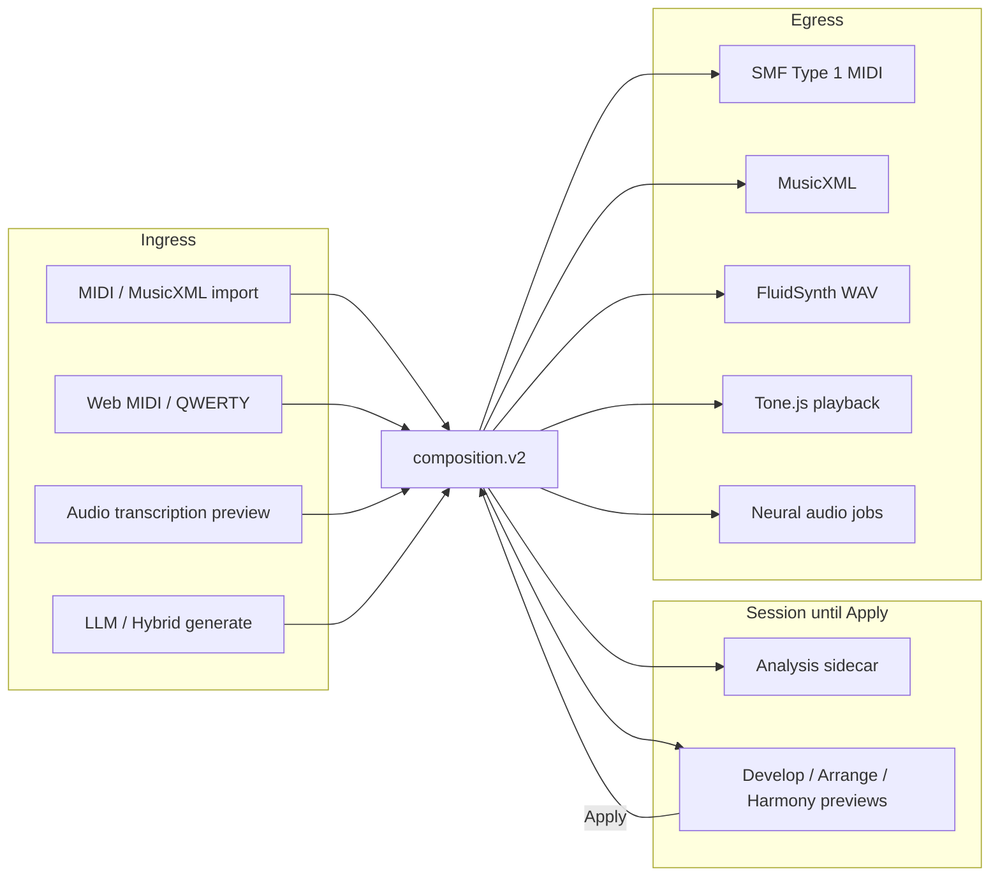
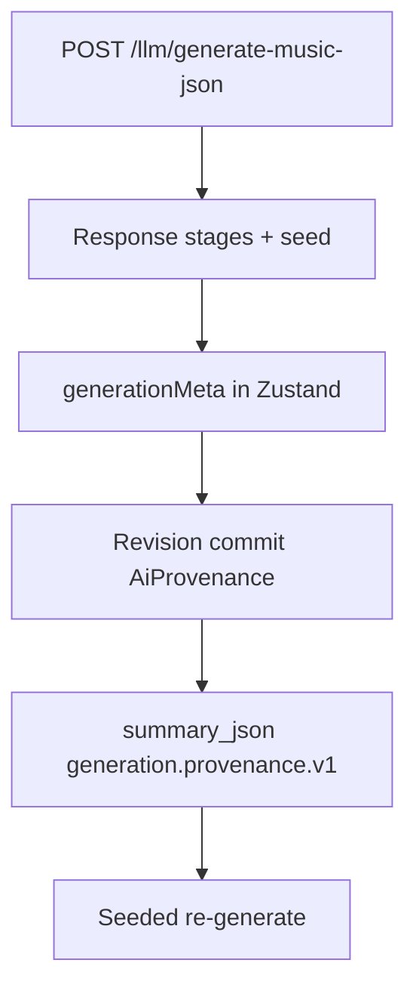
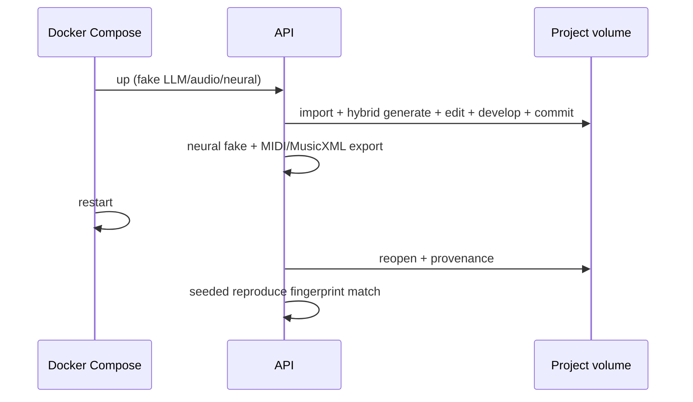

# DAW Interoperability

Hand off Mukit `composition.v2` scores to external DAWs via **Standard MIDI File (SMF Type 1)** and **MusicXML**. Product **V3** means the unified AI runtime platform — the playable schema remains **composition.v2** (there is no `composition.v3`).

## Locked selection

| Format | Role | Notes |
|--------|------|-------|
| **SMF Type 1** | Primary DAW handoff | Multi-track; conductor tempo/meter; program@0; CC; markers |
| **MusicXML 3.x / MXL** | Notation / score handoff | Automation often omitted (projection codes) |
| Ableton / Reaper project files | **Not written** | Import SMF into the DAW instead |

Proprietary writers (`.als`, `.rpp`, Logic/Cubase packs) are out of scope.

## Platform flow



## Export UX

In **Export**:

- **Download** Standard MIDI / MusicXML / deterministic WAV (FluidSynth).
- **Drag** `.mid` (and MusicXML when available) onto a DAW drop target — MIME `audio/midi` / `audio/mid`, fallback `application/octet-stream`.
- Copy emphasizes Ableton / Reaper / any DAW SMF handoff.
- Keep **Deterministic WAV** and **Neural Audio** visually distinct — neural jobs never mutate V2.

Stable download names: `{title-or-project}-export.mid` (and `.musicxml`).

## SMF Type 1 expectations

| Feature | Behavior |
|---------|----------|
| Tracks | Conductor + one MIDI track per V2 track |
| Names | `track_name` from V2 `name` / id |
| Channels | V2 `channel` 1–16; drums → 10 |
| Programs | Tick-0 `program_change` for pitched tracks (no mid-score program events) |
| Tempo / meter | Conductor `set_tempo` + `time_signature` maps |
| Markers | V2 `markers` + **section labels** projected as MIDI markers (`section_exported_as_marker`) when non-empty and not duplicate |
| CC | CC7/10/11/64 + sampled linear automation |

Sections never invent notes — only meta markers. Projection reports list omission/fidelity codes (see [composition-v2.md](composition-v2.md)).

## Ableton Live

1. Export or drag `.mid` from Mukit Export.
2. Drop onto a track or use **File → Import**.
3. Tempo/map and markers appear from the SMF conductor/meta tracks.
4. Assign Live instruments per MIDI track (Mukit programs are GM hints only).

**Limits:** No `.als` write; no clip envelopes beyond exported CC; neural audio is a separate WAV download, not a Live rack.

## Reaper

1. Drag `.mid` into the arrange view or **Insert → Media file**.
2. Markers and tempo map import with the SMF.
3. Split/take lanes as needed; replace GM programs with VSTs.

**Limits:** No `.rpp` write; MusicXML is better for notation-oriented workflows than for Reaper media items.

## Ardour (file import)

Live transport/mixer control is a separate OSC companion — see [ardour-companion.md](ardour-companion.md). Selected MIDI **region** round-trip (manifest + `material.mid`, cello counter-melody realize, aligned prepare) is documented in [ardour-session-exchange.md](ardour-session-exchange.md). Whole-score asset exchange still uses file export/import:

1. In Mukit **Export**, download **Standard MIDI** (primary), **MusicXML** (notation), and/or **WAV** (FluidSynth bounce).
2. In Ardour: **Session → Import** (or drag the file into the editor).
3. For SMF Type 1: choose MIDI tracks / tempo map as Ardour prompts; assign instruments per track (Mukit programs are GM hints).
4. For MusicXML: import when you want notation-oriented material; expect automation gaps vs MIDI.
5. For WAV: import as audio regions; this does not update `composition.v2`.

**Limits:** Mukit does not write Ardour session files. The OSC companion never silently rewrites notes from Ardour feedback.

## MusicXML

Use for Sibelius / Dorico / MuseScore / notation review. Expect `automation_omitted_from_notation` and related projection headers — MIDI remains the automation-faithful DAW path.

## Provenance (not in the MIDI file)

Hybrid / AI generate provenance (`generation.provenance.v1`: pipeline, stages, seed, compact config) lives on **revision `summary_json`**, not inside the SMF. See [hybrid-generation.md](hybrid-generation.md). Seeded reproduce: same pipeline + seed + installed models → matching composition fingerprint under fake/tiny fixtures (`scripts/v3_docker_acceptance.sh`).



## Security / installs

- Never embeds API keys, prompts, or absolute home paths in exports or revision summaries.
- Model checkpoints must sit under allowlisted roots (`MUSIC_TRANSFORMER_CHECKPOINT_DIR`, `models/`, `MUSIC_TRANSFORMER_ALLOWED_ROOTS`). Escapes → `model_path_rejected`.
- **No auto-download** of weights on `docker compose up` — see [music-transformer.md](music-transformer.md), [local-ai.md](local-ai.md), [neural-audio-rendering.md](neural-audio-rendering.md).

## Acceptance

```bash
RUN_DOCKER_ACCEPTANCE=1 ./scripts/v3_docker_acceptance.sh
```



## See also

- [composition-v2.md](composition-v2.md) — score contract + projection codes
- [ardour-companion.md](ardour-companion.md) — live Ardour OSC companion (V5)
- [ardour-session-exchange.md](ardour-session-exchange.md) — selected-region package exchange (V5)
- [import.md](import.md) — MIDI/MusicXML ingress
- [browser-playback.md](browser-playback.md) — Tone.js (not a DAW bridge)
- [testing.md](testing.md) — V1/V2/V3 Docker gates
