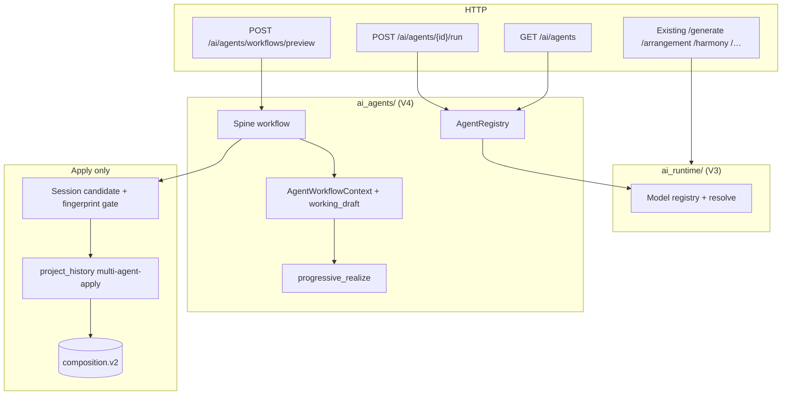

# Multi-Agent Music Architecture (V4)

Product **V4** is the multi-agent orchestration era. The canonical playable score remains **`composition.v2`**. There is no `composition.v4` schema.

Agents are **in-process services** under `backend/app/ai_agents/`. They sit **above** the V3 `ai_runtime` model registry, exchange typed artifacts (not freeform prompts), never write SQLite, and never mutate durable Composition. Only an explicit session Apply → revision CAS (`multi-agent-apply`) lands a candidate.

## Layering

```text
HTTP routers (ai_agents + existing composition routers)
        ↓
ai_agents/  (AgentRegistry, workflow orchestrator, fake/real adapters)
        ↓
services/   (realize/validate/analysis/arrangement/motif/reharm)
        ↓
ai_runtime/ (model resolve, protocols, provenance)
        ↓
persistence only via project_history Apply (never from agents)
```



## Agent inventory

| Agent id | Role | Mutates V2? |
|----------|------|-------------|
| `creative_director` | Brief + workflow plan | No |
| `structure_form` | Form / structure plan | No |
| `harmony` | Reharm / harmony proposals | No |
| `melody_motif` | Melody / motif drafts | No |
| `arrangement` | Texture redistribute candidate | No |
| `orchestration` | Instrument assignment notes | No |
| `performance_expression` | Expression advisory | No |
| `production` | Neural/production notes (egress) | No |
| `critic` | Critique approve/revise | No |

**Acceptance spine:** `creative_director` → `harmony` → `melody_motif` → `arrangement` → `critic`.

## Artifacts

Envelopes use `agent.artifact.v1` with known `content_type` values (`agent.brief.v1`, `agent.critique.v1`, `arrangement.candidate`, …). Payload must not be a raw prompt string. `mutates_composition` is always `false`.

## Progressive realize

`working_draft_composition` starts as a deep copy of source V2. Updates go only through `progressive_realize` wrappers around trusted services (`reharmonize_candidate`, `arrangement_candidate`, `motif_apply`, `validated_v2`). Inventing notes from brief/critique/plan/harmony metadata raises `working_draft_invalid`.

## Workflow preview

`POST /ai/agents/workflows/preview` returns:

- fingerprintable `candidate` (V2)
- `artifact_log`, `stages` (each with durable `agent_id`)
- `operation_type: "multi-agent-apply"`
- `mutates_composition: false`

Critic `approve` does **not** persist. Client Apply uses the existing CAS path with `RevisionOperationType.MULTI_AGENT_APPLY`.

## Discovery and single-agent run

- `GET /ai/agents` (+ `/{id}`) — descriptors, status, bound model public fields
- `POST /ai/agents/{id}/run` — isolated invoke; artifacts only

Filters: `capability`, `status`. Never exposes API keys or weight paths.

## Model binding

Default ops are mapped in `ai_agents/binding.py`. Override via request `agent_model_overrides` or env `AI_AGENT_<AGENT_ID>_MODEL`.

**Bootstrap:** `LLM_FAKE_MODE=1` registers deterministic fake agents (CI default). Otherwise the spine binds **real service wrappers** (`Harmony` → reharm preview, `Melody` → motif apply / validated pass-through, `Arrangement` → retain realize or preview, `Critic` → `composition.analysis.v1`) and the remaining four agents stay as typed stubs.

## Error codes

| Code | HTTP |
|------|------|
| `agent_not_found` | 404 |
| `agent_unavailable` | 503 |
| `artifact_kind_rejected` | 422 |
| `workflow_timeout` | 504 |
| `workflow_revise_exhausted` | 422 |
| `agent_model_unresolved` | 503 |
| `working_draft_invalid` | 422 |

## Logging / security

INFO: workflow_id, agent_id, artifact kind/content_type, model_id, duration_ms, recommendation.  
Never log prompts, API keys, full V2 event arrays, or full critique prose at INFO.

## Frontend

Thin **Agents** tab (`MultiAgentPanel`): Preview spine → Apply / Discard. Setting a multi-agent candidate discards competing arrangement / development / reharmonize session candidates.

## See also

- [AI Runtime](./ai-runtime.md) — models below agents
- [Composition V2](./composition-v2.md)
- [Composition Arrangement](./composition-arrangement.md)
- [Project persistence](./project-persistence.md)
