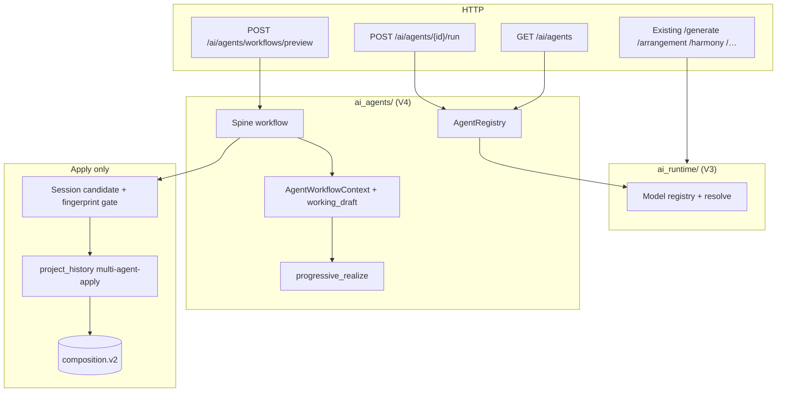

# Multi-Agent Music Architecture (V4)

Product **V4** is the multi-agent orchestration era. The canonical playable score remains **`composition.v2`**. There is no `composition.v4` schema.

Agents are **in-process services** under `backend/app/ai_agents/`. They sit **above** the V3 `ai_runtime` model registry, exchange typed artifacts (not freeform prompts), never write SQLite, and never mutate durable Composition. Only an explicit session Apply → revision CAS (`multi-agent-apply`) lands a candidate.

## Layering

```text
HTTP routers (ai_agents + existing composition routers)
        ↓
ai_agents/  (AgentRegistry, workflow orchestrator, fake/real adapters)
        ↓
services/   (realize/validate/analysis/arrangement/motif/reharm)
        ↓
ai_runtime/ (model resolve, protocols, provenance)
        ↓
persistence only via project_history Apply (never from agents)
```



## Agent inventory

| Agent id | Role | Mutates V2? |
|----------|------|-------------|
| `creative_director` | Brief + workflow plan | No |
| `structure_form` | Form / structure plan | No |
| `harmony` | Reharm / harmony proposals | No |
| `melody_motif` | Melody / motif drafts | No |
| `arrangement` | Texture redistribute candidate | No |
| `orchestration` | Instrument assignment notes | No |
| `performance_expression` | Expression advisory | No |
| `production` | Neural/production notes (egress) | No |
| `critic` | Critique approve/revise | No |

**Acceptance spine:** `creative_director` → `harmony` → `melody_motif` → `arrangement` → `critic`.

## Artifacts

Envelopes use `agent.artifact.v1` with known `content_type` values (`agent.brief.v1`, `agent.critique.v1`, `arrangement.candidate`, …). Payload must not be a raw prompt string. `mutates_composition` is always `false`.

## Progressive realize

`working_draft_composition` starts as a deep copy of source V2. Updates go only through `progressive_realize` wrappers around trusted services (`reharmonize_candidate`, `arrangement_candidate`, `motif_apply`, `validated_v2`). Inventing notes from brief/critique/plan/harmony metadata raises `working_draft_invalid`.

## Workflow preview

`POST /ai/agents/workflows/preview` returns:

- fingerprintable `candidate` (V2)
- `artifact_log`, `stages` (each with durable `agent_id`)
- `operation_type: "multi-agent-apply"`
- `mutates_composition: false`
- optional revision-loop fields: `revision_mode`, `max_passes`, `stop_reason`,
  `revision_history[]`, `pass_candidates[]` (session playable snapshots for
  audition/compare; not embedded in pass records), `last_valid_fingerprint`,
  `usage`

Critic `approve` does **not** persist. Client Apply uses the existing CAS path with `RevisionOperationType.MULTI_AGENT_APPLY`.

## Controlled critique → revision loops

Default product posture is **`revision_mode=off`** / `max_passes=0` (single Critic at end of spine; no automatic revise).

Named modes clamp revise passes (never unbounded):

| Mode | `max_passes` |
|------|--------------|
| `off` | 0 |
| `fast` | 1 |
| `balanced` | 2 |
| `thorough` | 3 |

Raw `max_revisions` (0–8) remains an API escape hatch when mode is `off`. When a
named mode is set, `max_revisions=0` (the request default) means “use the mode
cap”; a positive `max_revisions` may only further clamp downward. Product UI only
exposes Off / Fast / Balanced / Thorough.

Controller: `ai_agents/revision_loop.py` (no SQLite). Flow:

```text
spine → Critic (pass 0)
  → while revise + budget:
        RevisionPlan (ranges / tracks / target agents)
        → targeted spine agents only
        → CompositionPatch + progressive realize + preserve-outside-targets
        → validate → last_valid snapshot (or rollback on failure)
        → Critic again
  → stop_reason + revision_history[] + pass_candidates[] + final last_valid candidate
```

`revision_history` entries are non-playable digests (critique / plan / patch /
validation / fingerprints). Sibling `pass_candidates` carry fingerprintable
`composition.v2` snapshots for UI audition and compare; they are session-only
and never auto-committed.
**Stop reasons:** `critic_approve`, `hard_requirements_satisfied`, `improvement_below_threshold`,
`max_passes_reached`, `resource_budget_exhausted`, `cancelled`, `revise_exhausted`,
`validation_failed_kept_last_valid`.

**Preserve:** when `affected_ranges` / `affected_tracks` are set, events outside targets must
fingerprint-stable; violation fails the pass and restores `last_valid`.

**Cancellation:** cooperative between agents/passes. The route watches disconnect and sets the run cancel event (`docs/observability.md`). Model calls stop before the next provider request and between stream chunks. `KeyboardInterrupt` still propagates. Never leaves an invalid working draft.

**Operation summary:** preview and single-agent responses include `operation_summary` (`operation.summary.v1`): `run_id`, status, duration, model-call count, revision count, failure count, and `budget_code` when a ceiling stops the run. The Agents panel shows that line. Spans are logs, not a SQLite trace table. See [observability.md](observability.md).

**Usage:** optional `prompt_tokens` / `completion_tokens` / `latency_ms_total` with
`usage_status: available|partial|unavailable` — never invents currency.

**Logging:** INFO logs mode, pass_index, stop_reason, max_passes, duration_ms, usage_status,
fingerprint prefixes, target agent ids. Never INFO full findings, prompts, or event arrays.

Settings knobs: `REVISION_LOOP_*` in `.env.example` (improvement delta, wall/token caps, hard-ok policy).

Session `revision_history` is preview-only; durable promote of critique / revision_plan on Apply is unchanged.
Pass records do not require Alembic.

## Critic / Music Evaluation Engine

The Critic agent calls `services/composition_critique.evaluate_composition` (deterministic
checks + analysis warnings + optional model critique). Session UI can also call
`POST /critique/evaluate` without running the full spine. Critic remains **read-only**;
the revision **loop** is a workflow controller above Critic (see above).

- Structured findings use four strata (`hard_constraint` / `technical` / `stylistic` / `subjective`).
- Stylistic and subjective findings **never** alone force `revise`.
- Climax near-identical density emits `climax_lacks_contrast` (stylistic) without mutating V2.
- Full policy, scopes, and logging: [composition-critique.md](composition-critique.md).

## Discovery and single-agent run

- `GET /ai/agents` (+ `/{id}`) — descriptors, status, bound model public fields
- `POST /ai/agents/{id}/run` — isolated invoke; artifacts only

Filters: `capability`, `status`. Never exposes API keys or weight paths.

## Model binding

Default ops are mapped in `ai_agents/binding.py`. Override via request `agent_model_overrides` or env `AI_AGENT_<AGENT_ID>_MODEL`.

**Bootstrap:** `LLM_FAKE_MODE=1` registers deterministic fake agents (CI default). Otherwise the spine binds **real service wrappers** (`Harmony` → reharm preview, `Melody` → motif apply / validated pass-through, `Arrangement` → retain realize or preview, `Critic` → Music Evaluation Engine / `composition_critique`) and the remaining four agents stay as typed stubs.

## Error codes

| Code | HTTP |
|------|------|
| `agent_not_found` | 404 |
| `agent_unavailable` | 503 |
| `artifact_kind_rejected` | 422 |
| `workflow_timeout` | 504 |
| `workflow_revise_exhausted` | 422 |
| `agent_model_unresolved` | 503 |
| `working_draft_invalid` | 422 |
| `artifact_dependency_unsatisfied` | 422 |
| `artifact_immutable_violation` | 422 |
| `artifact_not_found` | 404 |
| `artifact_payload_rejected` | 422 |
| `artifact_playable_fields_forbidden` | 422 |
| `artifact_retention_rejected` | 422 |
| `workspace_quota_exceeded` | 429 |

## Shared Musical Workspace (typed agent-artifact graph)

Cooperating agents exchange **typed, immutable** plans/analysis inside `agent.artifact.v1` envelopes. Canonical playable notes stay on `composition.v2` only — plans never become an alternate score (`composition.v4` unsupported).

```text
composition.v2 revision
  → AgentWorkflowContext (session slots + working_draft)
  → agents emit typed payloads (brief / harmony_plan / motif_plan / …)
  → [default] session-only artifact_log until Apply
  → [optional] temporary SQLite rows when preview sets persist_workspace_artifacts
  → progressive realize → fingerprintable candidate V2
  → Apply (multi-agent-apply CAS) + artifact_role_map
  → INSERT durable rows + revision_artifact_links (same transaction)
  → Versions UI shows role summary (Brief / Harmony / Motif / …)
```

**Inventory (content types):** `agent.brief.v1`, `composition.plan.v1`, `agent.form_plan.v1`, `agent.harmony_plan.v1`, `agent.motif_plan.v1`, `agent.arrangement_plan.v1`, `agent.orchestration_plan.v1`, `agent.performance_plan.v1`, `agent.production_plan.v1`, `composition.analysis.v1` / bounded projection, `agent.critique.v1`, `agent.revision_plan.v1`, `agent.composition_patch.v1`, `agent.render_plan.v1`.

**Dependencies (examples):** MotifPlan → Brief + HarmonyPlan; ArrangementPlan → CompositionPlan or (FormPlan + HarmonyPlan) plus source revision/fingerprint; RevisionPlan → Critique with `recommendation=revise`; CompositionPatch → at least one realize-understood plan.

**Immutability:** INSERT-only payloads; `content_digest = sha256(canonical_json(payload))`. Corrections = new `artifact_id` + `supersedes_artifact_id`. Agents never import `agent_artifact_workspace` / SQLite.

**Apply contract:** FE builds `generation_parameters.artifact_role_map` from preview `artifact_log` (roles: `brief`, `harmony_plan`, `motif_plan`, `arrangement_plan`, `critique`, optional `revision_plan`) and sends envelopes for promote. Server validates roles and promotes in the DurableCommit transaction.

**History:** Revision list/detail for `multi-agent-apply` include `summary.ai_artifacts` (`revision.ai_artifact_summary.v1`) — role metadata only. Optional `GET /projects/{id}/artifacts/{artifact_id}` for size-capped inspect.

**Retention:** Temporary TTL `AGENT_ARTIFACT_TEMP_TTL_HOURS` (default 24); cap `AGENT_ARTIFACT_TEMP_MAX_PER_PROJECT` (default 200). Durable rows live with the project (CASCADE delete).

**Anti-patterns:** mutable blackboard; agents writing SQLite; embedding full V2 in CompositionPatch; dumping payloads on revision list; auto-applying Critic approve.

## Logging / security

INFO: workflow_id, agent_id, artifact kind/content_type, model_id, duration_ms, recommendation, promote role keys, GC deleted counts.  
Never log prompts, API keys, full V2 event arrays, full payloads, or full critique prose at INFO.

## Frontend

Thin **Agents** tab (`MultiAgentPanel`): revision mode selector (Off/Fast/Balanced/Thorough),
Preview spine → Cancel / Apply / Discard, inspectable pass history + fingerprint compare.
Setting a multi-agent candidate discards competing arrangement / development / reharmonize session candidates. Versions panel shows AI role summary for multi-agent revisions.

## See also

- [AI Runtime](./ai-runtime.md) — models below agents
- [Composition V2](./composition-v2.md)
- [Composition Arrangement](./composition-arrangement.md)
- [Project persistence](./project-persistence.md)
